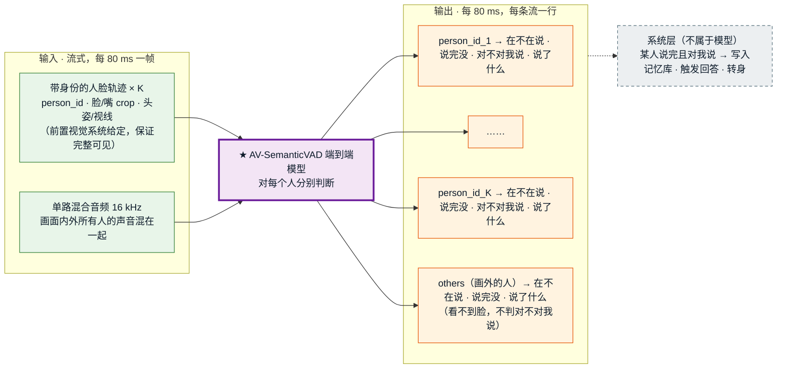
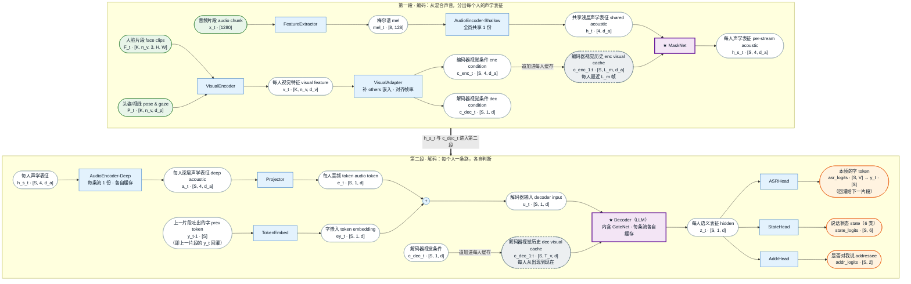
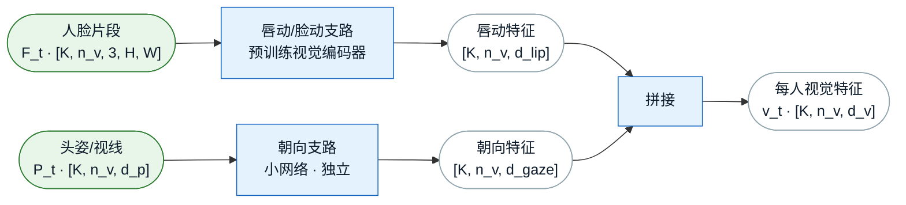
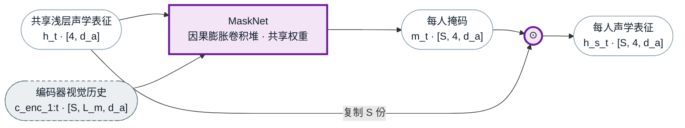
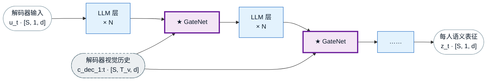

# 模型架构 v6.2 —— forward 契约（输入 · 两级条件化 · 输出 · 运行情形）

> **本文件 = 模型契约的唯一权威。** 对外定位（new setting / 三点贡献 / 竞品口径）以
> [`cvpr-framing.md`](cvpr-framing.md) 为准，本文件不重复、也不得与之冲突。
> 旧的 v4/v5 架构文档、旧实施计划、旧 benchmark 提案已于 2026-09-21 删除（git `ac5dee1` 可取回）。
>
> **三条已拍板的根基** ✅
> - **骨干 = X2-Turn（Voxtral 流式版，X2-Turn-4B-0812）**，Route A 热启动（cvpr-framing §8）。
> - **★ 两级条件化**（v6.2 新）：视觉既在**音频编码器浅层**做 per-face 掩码（管分离/ASR），
>   又在 **LLM 层**做门控 cross-attn（管状态/addressee）。batch 维 = 流数。
> - **流的集合 = 画面内 K_t 张脸 ＋ 一条常驻 `others` 流**，恒 ≥ 1 条。
>
> **★ 模型边界（2026-09-24 拍板）✅**：**身份不归模型管。** 新客/熟人判定、re-ID、`person_id`、名字
> 全部由**前置视觉系统**在进入模型之前给定。模型只负责每个人的
> **{在不在说 · 是否在对我说 · 说完没}**（外加 ASR 文本）。
>
> **★ 人脸输入假设（2026-09-24 拍板）✅**：**传进来的每张脸都是稳定、完整可见的。**
> 只要前置系统给出某个 `person_id`，这一帧他的脸就一定完整露出（不遮挡、不背身、不模糊）；
> 看不清的脸由前置系统负责**不传**。因此输入里**没有 `valid` 标记**，模型不处理遮挡。
>
> **★ 资源前提（2026-09-24 拍板）✅**：人力、物力、算力充足，**数据不是问题**（详见 cvpr-framing 文首）。
> 本文件的设计取舍一律**不以数据量 / 算力为约束**；下文凡与 AMI 规模对比处，只作为参照系，不作为风险。
>
> 标记：✅ 已定 ｜ 💡 建议待拍板 ｜ ⏳ 待实验定 ｜ ⚠️ 风险
>
> **最后更新**：2026-09-24（v6.2；按"端到端总览 → 模块化中间流程 → 细致结构"重排，删去版本演进 / 一页纸总览 / 输入契约）

---

## 0. 端到端总览（自顶向下 · 先把模型当黑盒）

> 本节只回答一件事：**模型吃什么、吐什么。** 内部怎么拆，见 §1（模块化的中间流程）；更细的结构定义在其后。



### 0.1 输入

| 输入 | 内容 | 来源 |
|---|---|---|
| **人脸轨迹 × K**（K 可为 0，随人进出变化） | 每张脸：`person_id`、脸/嘴 crop、头姿 + 视线。**传进来的脸一定完整可见** | 前置视觉系统（检测 + 跟踪 + 认人），**身份在进模型前已确定** |
| **混合音频** | 单通道 16 kHz，画面内外所有人的声音 | 麦克风（阵列先降成单路） |

### 0.2 输出（每条流 × 每 80 ms）

流 = 画面内 K 张脸各一条 ＋ 一条常驻 `others`（画外的人），共 K+1 条。

| 输出 | 取值 | 回答的问题 | 实现（§2） |
|---|---|---|---|
| `person_id` | 原样透传 | 这一行是谁 | 不参与计算 |
| 状态 | 沿用 X2-Turn 6 类：`idle` / `noidle` / `speaking` / `turn_end` / `backchannel` / `uncertain` | **在不在说 · 说完没 · 是不是附和** | `state_logits`，6 类单头（§2.1） |
| addressee | `对我说` / `不对我说` / 弃权 | **是不是在对机器人说** | `addr_logits`；`others` 弃权（看不到脸） |
| 文本 | 这一帧新增的 1 个 token；没有新字时为空（PAD） | **说了什么**（系统层按人拼接成句） | `asr_logits`，每人一条独立 ASR |

```json
// 某一 80 ms 帧的输出示例（K=2）
[
  {"person_id": "p_0042", "state": "turn_end",    "addressee": "对我说",   "text_delta": "奶"},
  {"person_id": "p_0043", "state": "backchannel", "addressee": "不对我说", "text_delta": "嗯"},
  {"person_id": "others", "state": "idle",        "addressee": "弃权",     "text_delta": ""}
]
```

> 模型**到输出为止**。"什么时候回应、回应谁、写不写记忆库"都在系统层（见 cvpr-framing「业务闭环」）。

---

## 1. 中间流程

> 本节自顶向下：**§1.0 先把一个 80 ms 片段从进到出走一遍**（模块只写抽象名，不写层数、参数），
> §1.1 讲为什么视觉要分两级接入；§1.2（第一阶段）和 §1.3（第二阶段）按 §1.0 的顺序逐个模块拆解；
> §1.4 是贯穿两阶段的规则；最后一步 ⑧ 三个输出头见 §2。

### 1.0 一个 80 ms 片段的一生

设当前是第 `t` 个 80 ms 片段，画面里有 `K` 个人 → 共 `S = K + 1` 条流（K 张脸 ＋ 1 条 `others`）。



**符号**

| 符号 | 含义 | 取值 |
|---|---|---|
| `K` / `S` | 画面人数 / 流数 `S = K + 1` | 随人进出变化，`S ≥ 1` |
| `n_v` | 80 ms 内的视频帧数 | 25 fps 时 ≈ 2 |
| `H, W` / `d_p` / `d_v` | 人脸 crop 尺寸 / 头姿视线维度 / 视觉特征维度 | ⏳ 随视觉编码器选型定 |
| `d_a` | 音频编码器宽度 | 1280 |
| `d` | 解码器（LLM）宽度 | 3072 |
| `V` | 词表大小 | 131072 |
| `L_m` | MaskNet 能看到的视觉历史长度（编码器帧，20 ms/帧） | ⏳ 由 MaskNet 的感受野定 |
| `T_v` | 解码器视觉缓存长度（片段数，80 ms/个） | 从这个人出现起累积；⏳ 是否设上限待定 |

**逐步说明**（音频侧编号 ①–⑤、视觉侧 Ⓐ–Ⓑ，在 ⑥ 汇合）

| 步 | 模块 | 输入 → 输出 | 做了什么 | 份数 |
|---|---|---|---|---|
| ① | FeatureExtractor | `x_t [1280]` → `mel_t [8, 128]` | 80 ms 波形 → 8 帧梅尔谱（100 Hz） | 1 |
| ② | AudioEncoder-Shallow | `mel_t` → `h_t [4, d_a]` | 降到 4 帧（50 Hz，20 ms/帧），得到**混合**的浅层声学表征 | **1（共享）** |
| Ⓐ | VisualEncoder | `F_t, P_t` → `v_t [K, n_v, d_v]` | 每张脸的唇动 + 头姿视线编码 | 每脸 1 |
| Ⓑ | VisualAdapter | `v_t` → `c_enc_t [S, 4, d_a]`、`c_dec_t [S, 1, d]` | 补上 `others` 的可学习嵌入（K → S）；按时间戳对齐到编码器 4 帧 / 解码器 1 帧 | 1 |
| ③ | ★ MaskNet（L1） | `h_t` + `c_enc_1:t` → `h_s_t [S, 4, d_a]` | 用每个人**最近一段的嘴部动作**（不只是当前两帧），把混合声学表征里**属于他的那部分**掩出来 | 共享权重，出 S 份 |
| ④ | AudioEncoder-Deep | `h_s_t` → `a_t [S, 4, d_a]` | 每条流独立继续编码 | **S** |
| ⑤ | Projector | `a_t` → `e_t [S, 1, d]` | 4 帧拼成 1 个 80 ms 的音频 token | S |
| ⑥ | TokenEmbed + 相加 | `y_t-1 [S]` → `ey_t`；`e_t + ey_t` → `u_t [S, 1, d]` | 把**这个人上一帧吐出的字**加到本帧音频上（X2-Turn 原做法） | S |
| ⑦ | ★ Decoder（L2 = 内含的 GateNet） | `u_t` + `c_dec_1:t` → `z_t [S, 1, d]` | 结合这个人**从头到现在的声音和已识别的文字**；GateNet 再注意他**从出现到现在的视觉**（视线朝向持续了多久、嘴动的节奏）做二次条件化 | **S** |
| ⑧ | 三个头 | `z_t` → `asr_logits [S, V]`、`state_logits [S, 6]`、`addr_logits [S, 2]` | 同一个 `z_t` 读出：说了什么 / 说话状态 / 是否对我说 | 共享权重 |

**跨片段带走的东西**（下一个 80 ms 片段要用）

| 带走什么 | 份数 | 作用 |
|---|---|---|
| 浅层编码器的缓存 | 1（共享） | 卷积和注意力的历史 |
| 编码器视觉缓存 `c_enc_1:t` | 每条流 1 份 | 最近 `L_m` 帧的嘴部动作；MaskNet 靠它判断"嘴在不在持续动"（它的卷积缓存里同时存着过去的 `h`） |
| 深层编码器的缓存 | 每条流 1 份 | 这个人的声学历史 |
| 解码器的缓存 | 每条流 1 份 | 这个人**说过的话 + 已识别的文字**，是判断"说完没"的依据 |
| 解码器视觉缓存 `c_dec_1:t` | 每条流 1 份 | 这个人从出现到现在的视觉；GateNet 靠它判断"是不是一直朝着我"。`others` 流里存的是可学习嵌入 |
| `y_t` | 每条流 1 个 | 回灌为下一片段的 `y_t-1` |

**两点要记住**
- **输出描述的是 480 ms 之前的音频**：骨干自带 6 帧延迟，第 `t` 片段吐出的 `state` / `y_t` 对应的是 `t − 6` 那一帧（§1.4.1）。
- **只有 ② 是全员共享的，从 ③ 起每个人一条路**：人和人之间不通信（§1.4.2）；`others` 走同一条路，只是视觉条件换成可学习嵌入（§1.4.4）。

### 1.1 ★ 为什么必须两级：v6/v6.1 的注入位置错了

**文献的一致做法**（§7 有完整出处）：

- Whisper-Sidecar 把分离器插在**编码器第 2 与第 3 块之间**，理由是
  "the ASR encoder captures more acoustic information in its **lower layers** and more linguistic
  information in the upper layers"。
- NVIDIA 四类架构里，masked input 在 "**audio feature input level**" 注入；
  WL-SOT 把 diarization 预测 "embedded into the **ASR encoder state**"；SSA 建在流式 ASR 模型内部。
- MISP 在**信号级**用 GSS 引导分离。

**没有任何一个把说话人线索放在编码器下游的语言模型里。而 v6/v6.1 正是这么做的。**

**为什么这在我们这里格外致命**：视觉条件在 v6.1 里进入 LLM 时，音频已经
① 被一个单说话人语料训出的 **32 层编码器**压过；② 被 **4× 降采样到 80 ms/帧** ——
音素率约 10–15/秒，**一帧里塞着两个说话人交错的音素**。

⚠️ **而且我们自己的探针可能一直在警告这件事**：噪声 gate 那个 **0.47** 测的就是 LLM 的 hidden，
即编码器**之后**。那个数字的含义可能不是"混音难判"，而是"**信息在到达那里之前就已被抹掉**"。
若如此，"在 LLM 层注入视觉"与"在 LLM 之后读出"（消融臂 A）差别很小 —— 两者都在往一个已塌的表征上加条件。

**修正 = 两级分工**，与我们的第一原则一致：

| 级 | 位置 | 职责 | 对应的模态分工 |
|---|---|---|---|
| **L1** | 编码器浅层（层 2 后） | **声学分离**：把混音里属于这张脸的部分掩出来 | 视觉做**归属** |
| **L2** | LLM 各层 | **语义条件化**：说话状态 + addressee | 音频做**内容/完整性**，视觉给**朝向** |

⏳ **注入深度本身是待测超参**，不是信仰：恢复实验的主轴就是它（§6.1）。

### 1.2 第一阶段 · 编码：从混合声音，分出每个人的声学表征

> 每个模块按同一个格式写：**做什么 · 输入 → 输出 · 内部结构 · 来源与训练 · 要点 · 待定**。
> 这里只拆到"模块里面有哪几块"，层数、宽度等超参留到细致结构定义。

#### 1.2.1 ① FeatureExtractor —— 波形变梅尔谱

- **做什么**：把 80 ms 波形变成声学特征。
- **输入 → 输出**：音频片段 `x_t [1280]` → 梅尔谱 `mel_t [8, 128]`（100 Hz，每帧 10 ms）。
- **内部结构**：短时傅里叶变换 + 梅尔滤波，无可学习参数。
- **来源与训练**：X2-Turn（Voxtral）原样复用，不训练。
- **要点**：分析窗比 10 ms 的帧移长，流式时要**保留上一片段末尾的一小段波形**，否则片段边界处的特征不对。

#### 1.2.2 ② AudioEncoder-Shallow —— 全员共享的浅层声学编码

- **做什么**：把梅尔谱编码成浅层声学表征。此时声音还是**混合**的，所有人共用这一份。
- **输入 → 输出**：`mel_t [8, 128]` → 共享浅层声学表征 `h_t [4, d_a]`（50 Hz，每帧 20 ms）。
- **内部结构**：X2-Turn 音频编码器的前段 = 两层因果卷积（顺带把帧率从 100 Hz 降到 50 Hz）＋ 编码器前 2 层。
- **来源与训练**：X2-Turn 原权重；第一阶段训练时冻结。
- **要点**：
  - **只算 1 份**，是整个模型里唯一全员共享的计算。
  - 跨片段缓存：卷积缓存 ＋ 前 2 层的注意力缓存，也只存 1 份。
  - 为什么在第 2 层之后切开：编码器越浅越偏声学、越深越偏语言，分离要趁声学信息还在的时候做（§1.1）。
- **待定** ⏳：切开的深度（第几层之后）本身是待测超参，属于注入深度实验（§6.1）。

#### 1.2.3 Ⓐ VisualEncoder —— 每张脸的视觉编码



- **做什么**：把每张脸编码成视觉特征，分两条支路：**嘴在不在动**（服务分离）和**朝着哪里**（服务 addressee）。
- **输入 → 输出**：`F_t [K, n_v, 3, H, W]` ＋ `P_t [K, n_v, d_p]` → 每人视觉特征 `v_t [K, n_v, d_v]`。
- **内部结构**：唇动/脸动支路 ＋ 头姿视线支路，两路输出拼接。K 张脸共享权重，按人并行。
- **来源与训练**：唇动支路用预训练模型；朝向支路新建。
- **要点**：
  - **朝向支路必须独立**，不能被唇动支路吞掉 —— "是不是对我说"主要靠它。
  - ⚠️ **必须因果**：常见的唇读前端在时间上是居中卷积（会看未来几帧），要改成只看过去。
- **待定** ⏳：
  - 唇动支路选型：💡 AV-HuBERT 视觉前端（输出序列表征，适合当条件）vs Light-ASD / TalkNet（输出偏"是否在说"的二分类，不适合当条件）。
  - 唇动支路第一阶段冻结还是轻微微调。

#### 1.2.4 Ⓑ VisualAdapter —— 对齐帧率、补上 others、分出两路条件

- **做什么**：把视频帧率的视觉特征，变成编码器和解码器各自能用的条件，并补上 `others` 流。
- **输入 → 输出**：`v_t [K, n_v, d_v]` → 编码器视觉条件 `c_enc_t [S, 4, d_a]` ＋ 解码器视觉条件 `c_dec_t [S, 1, d]`。
- **内部结构**（三件事）：
  1. **帧率对齐**：按时间戳，在每个 20 ms 格子上取**最近一帧已到达的视频**（不插值，插值要等下一帧，多 40 ms 延迟）→ 每片段 4 格；给解码器的那一路再把 4 格池化成 1 个。
  2. **投影**：两个线性投影，分别映射到编码器宽度 `d_a` 和解码器宽度 `d`。
  3. **补 others**：在 K 张脸后面追加 `others` 的可学习嵌入（`E_enc`、`E_dec`），K → S。
- **来源与训练**：新建，第一阶段训练。
- **之后**：两路条件分别追加进每人的视觉缓存 —— `c_enc_1:t`（最近 `L_m` 帧，给 MaskNet）和 `c_dec_1:t`（从出现到现在，给 GateNet）。
- **待定** ⏳：
  - 视觉比音频晚到（检测 + 跟踪 + 认人的耗时）如何对齐：倾向**音频先缓冲一个固定的 Δv**（§1.4.1）。
  - 给 `others` 追加"当前可见人脸集合的池化表征"（§1.4.4）。

#### 1.2.5 ③ MaskNet（L1）—— 用视觉把混合声音分到每个人



- **做什么**：对每条流，用这个人最近一段的嘴部动作，把混合声学表征里**属于他的那部分**掩出来。
- **输入 → 输出**：`h_t [4, d_a]` ＋ `c_enc_1:t [S, L_m, d_a]` → 每人掩码 `m_t [S, 4, d_a]` → 每人声学表征 `h_s_t = h_t ⊙ m_t`，`[S, 4, d_a]`。
- **内部结构**：声学表征与视觉条件按通道拼接 → 因果一维膨胀卷积堆（Conv-TasNet / Whisper-Sidecar 的做法）→ 残差掩码 `m = 1 + tanh(α)·Δ`。
- **来源与训练**：新建，第一阶段训练。S 条流共享权重。
- **要点**：
  - **零初始化**：末层置零、`α` 初值 0 → 训练开始时 `m ≡ 1`，模型**逐比特等于纯 X2-Turn**（§5.1 单测）。
  - 每条流各算各的掩码，**流之间不做归一化**（不要求各人掩码加起来等于 1，§1.4.2）。
  - 实现已核实：编码器的前向就是一个逐层循环（`modeling_voxtral_realtime.py:592`），在第 2 层后拆成两段即可。
- **待定** ⏳：MaskNet 的结构与容量；视觉历史长度 `L_m`。

### 1.3 第二阶段 · 解码：每个人一条路，各自判断

> 从这里开始，**每条流一份计算、一份缓存**，流与流之间不通信。S 条流按 batch 并行。

#### 1.3.1 ④ AudioEncoder-Deep —— 每人继续声学编码

- **做什么**：对分出来的每人声学表征继续编码。
- **输入 → 输出**：`h_s_t [S, 4, d_a]` → 每人深层声学表征 `a_t [S, 4, d_a]`。
- **内部结构**：X2-Turn 音频编码器的其余层（第 3 层到最后一层），因果、滑动窗口注意力。
- **来源与训练**：X2-Turn 原权重；第一阶段冻结，第二阶段开 LoRA 或全量微调（§4.1）。
- **要点**：每条流有自己的注意力缓存（这个人的声学历史）。这是 v6.2 相对 v6.1 新增的主要计算量（§6.6）。

#### 1.3.2 ⑤ Projector —— 4 帧并成 1 个 80 ms token

- **做什么**：把编码器的 4 帧（20 ms/帧）拼成 1 个 80 ms 的音频 token，映射到解码器宽度。
- **输入 → 输出**：`a_t [S, 4, d_a]` → 每人音频 token `e_t [S, 1, d]`。
- **内部结构**：4 帧拼接 → 线性映射。
- **来源与训练**：X2-Turn 原权重，原样复用。

#### 1.3.3 ⑥ TokenEmbed ＋ 相加 —— 把"这个人上一帧说出的字"加进来

- **做什么**：把这个人上一片段吐出的字，和本片段的音频加在一起，作为解码器输入。
- **输入 → 输出**：上一片段的字 `y_t-1 [S]` → 字嵌入 `ey_t [S, 1, d]`；`u_t = e_t + ey_t`，`[S, 1, d]`。
- **内部结构**：查词嵌入表，再与音频 token 逐位相加。
- **来源与训练**：X2-Turn 原做法与原权重（上游 `modeling_voxtral_realtime.py:1067-1078`）。
- **要点**：
  - 这就是**文字回流**：解码器因此能看到这个人已识别出的文字，"说完没"依赖它。
  - 没说话时回流的是 PAD（`STREAMING_PAD_ID = 32`）。
  - ⚠️ 训练时回流标注的正确文字，推理时回流模型自己识别的文字，两者有差距；重叠时识别更差，差距更大。⏳ 考虑训练时混入模型自己的识别结果（scheduled sampling）。

#### 1.3.4 ⑦ Decoder ＋ GateNet（L2）—— 每人的语义判断



- **做什么**：结合这个人从头到现在的声音和已识别的文字，形成他的语义表征；GateNet 再把他的视觉（主要是朝向）注入进去。
- **输入 → 输出**：`u_t [S, 1, d]` ＋ `c_dec_1:t [S, T_v, d]` → 每人语义表征 `z_t [S, 1, d]`。
- **内部结构**：
  - Decoder = X2-Turn 的 LLM，因果，每条流自己的注意力缓存。
  - GateNet = 每隔 N 层插一个门控交叉注意力：`h ← h + tanh(α)·CrossAttn(Q = h, K = V = c_dec_1:t)`，`α` 初值 0。
- **来源与训练**：LLM 用 X2-Turn 原权重（第一阶段冻结，第二阶段 LoRA 或全量）；GateNet 新建，第一阶段训练。
- **要点**：
  - 零初始化：`α = 0` 时 GateNet 无贡献，等于纯 X2-Turn。
  - 视觉注入在和音频、状态读出**同一个位置**，所以自动获得同样的 480 ms 前瞻（§1.4.1）。
  - 解码器缓存里存着这个人说过的话和已识别的文字，是判断"说完没"的依据。
- **待定** ⏳：插入间隔 N；GateNet 注意的视觉历史长度 `T_v` 是否设上限。

### 1.4 贯穿两阶段的规则

#### 1.4.1 ⚠️ 时间对齐（最容易静默写错的地方）

- **两个帧率别混**：编码器内部 50 Hz（20 ms/帧），解码器 12.5 Hz（80 ms/帧），1 个解码器帧 = 4 个编码器帧。
- **输出落后 480 ms**：X2-Turn 自带 6 帧延迟，第 `t` 片段吐出的结果对应 `t − 6` 那一帧。解码器侧只用一条索引规则：
  ```
  prediction_index = prefix_length + frame_index - 1        # inference.py:165，next-token 语义
  ```
  视觉按同一位置注入，自动获得同样的前瞻。
- **视频 → 20 ms 格子**：按时间戳取最近一帧（§1.2.4），不插值。
- ⏳ **视觉晚到**：MaskNet 在编码器里，音频一到就要算，但视觉要等检测、跟踪、认人。倾向音频先缓冲固定的 Δv（待实测），训练时加 ±40 ms 抖动。
- 两级的对齐都由 §5.2 / §5.3 的脉冲响应单测兜住。

#### 1.4.2 流间不通信，不做跨人归一化 ✅

诱惑是在流之间做 softmax（"这帧属于谁"）。**不做**：
1. 真重叠时多人同时说，"归一化到 1"是错的前提 —— 这正是 VAP 家族塌成只剩一个说话人的起点。
2. **不需要**：不说话的人 ASR 标签是**全 PAD**（§4.3），竞争信号从标签进来，不必从结构进来。

#### 1.4.3 流的生老病死 ✅

| 事件 | 处理 |
|---|---|
| 新人出现（前置系统开始传这个 `person_id`） | **新开一条流**，第二阶段的各缓存与视觉缓存从当前时刻冷启动 |
| 持续在画面 | 增量处理，维护自己的缓存 |
| 离开（前置系统不再传这个 `person_id`） | 该流**销毁**，缓存释放 |
| 离开又回来 | **新开一条流**；前置系统给回同一个 `person_id`，输出照常挂在他名下。模型自身不做认人 |

每条流自己的缓存：编码器视觉缓存、深层编码器缓存、解码器缓存、解码器视觉缓存、上一片段的字 `y_t-1`。
⚠️ 新流拿不到出现之前的上下文，前几百 ms 的判断不可信 → 系统层按 `uncertain` 处理。
⏳ 可选优化：同一个人的流重开时，从记忆库取他最近几句话的文字作为前缀先喂进去。

#### 1.4.4 ★ 常驻 `others` 流（画外说话人）✅

**定义**：除画面内 K 张脸外，恒定再开一条流，代表"声音属于某个我看不见的人"。
它走和人脸流完全相同的两个阶段，只是视觉条件换成可学习嵌入（`E_enc`、`E_dec`，在 Ⓑ 里补上）。

| | 人脸流 | `others` 流 |
|---|---|---|
| 视觉条件 | 这张脸的唇动 + 朝向 | **可学习嵌入**（无脸） |
| addressee | 由朝向判断 | **永久弃权** |
| 存在性 | 随人进出 | **常驻**，画面没人时是唯一的流 |

**它解决了什么**：① 画面里的人都没说、但画外有人说时，声音有地方去；② 画外语音有**正样本**监督；③ 画面没人不再是特例。

**⚠️ 能力边界**：`others` 只有固定嵌入，没有唇动这种随时间变化的线索，实际是在做**无线索的盲分离**。
- ✅ **检测**："有个看不见的人在说 / 说完没" —— 不重叠时可信；
- ⚠️ **转写**：重叠时不保证质量，系统层按低置信处理；
- ❌ **多个画外说话人**：压成一条流，完整性不可信。

💡 **建议**：给 `others` 追加"当前可见人脸集合的池化表征"作为条件（"排除这些人之后剩下的声音"），不破坏 §1.4.2。
❌ **不采纳**：给 `others` 累积说话人声音记忆 —— 与"不用声纹"的设定冲突。

**与"视觉整体失效"不是一回事**：画面没人时 `others` 带着嵌入运行；而摄像头坏了时，所有视觉条件置零、两级 `α` 置零 → 逐比特退化为纯 X2-Turn（§5.1 测的是后者）。`E_others ≠ 0`，所以"画面没人时的 others 流"不等于纯 X2-Turn。

#### 1.4.5 ★ 视觉消解了说话人排列歧义

PIT、SOT 以及 NVIDIA 的 PI-DTW，存在的全部理由都是解决排列歧义 —— 纯音频系统不知道第一条输出该对应哪个人。
**我们每条流都绑着一个 `person_id`，排列歧义天然不存在。** 这是视觉条件相对 diarization 条件的结构性好处，值得写进论文。
**代价**：标注必须把每句话绑到具体的人脸上（§4.4）。

---

## 2. 输出契约 ✅ —— ⑧ 三个输出头

> 对应 §1.0 的第 ⑧ 步：三个头都读同一个每人语义表征 `z_t [S, 1, d]`。forward 到这里为止，只吐 logits。

| 输出 | 每片段 shape | 实现 | 热启动 |
|---|---|---|---|
| `asr_logits` | `[S, V]` → 取最大得 `y_t [S]`（回灌给下一片段） | 复用 X2-Turn 的 `lm_head` | ✅ 继承 X2-Turn |
| `state_logits` | `[S, 6]` | **新** 线性头，`d → 6` | ✅ 拷 `vad_lm_head` 第 35–40 行 |
| `addr_logits` | `[S, 2]` | **新** 线性头，`d → 2` | ❌ 随机；`others` 永久弃权 |

三个头在人脸流与 `others` 流之间**共享权重**。训练时的 shape 前面再加 batch 和时间维：`[B, S, T, ·]`。

### 2.1 状态：沿用 X2-Turn 6 类 ✅（2026-09-24 改，取代原三态）

| id | 类 | 含义 | 业务上怎么用 |
|---|---|---|---|
| 35 | `idle` | 没在说话 | — |
| 36 | `noidle` | 有声音但无语义（清嗓、咳嗽、开口前的"呃"） | 不能打断机器人 |
| 37 | `speaking` | 在说有语义的话，还没说完 | 在说；机器人说话时可打断 |
| 38 | `turn_end` | **说完了**（持续 1–2 帧的**事件**，之后回到 `idle`） | 触发回答 = **语义完整性** |
| 39 | `backchannel` | 附和（"嗯嗯""对""好的"） | 不打断、不回答、不写记忆库 |
| 40 | `uncertain` | 拿不准 | 系统层按低置信处理 |

**为什么不用原三态** `{静默 · 说话-incomplete · 说话-complete}`：
1. 原三态把 `turn_end` 当成持续状态，但在 X2-Turn 里它是**说完那一刻的 1–2 帧事件**
   （`README.md:125-126`：说话 → `turn_end` → `idle`），标签定义与热启动来源对不上。
2. 原三态丢掉了 `noidle` / `backchannel` / `uncertain`，而这三类正是 X2-Turn 控制器判断
   "能不能打断、是不是附和"的依据（`turn/controller.py` 顶部规则）。

**热启动**：`vad_lm_head` 是 `lm_head` 的整词表拷贝，只有 id 35–40 有意义（`modeling.py:15-23`）：

```
state_head.weight[0:6] ← vad_lm_head.weight[35:41]   # 6 行全拷，顺序与 TURN_CLASS_NAMES 一致
```
→ day-0 就等于 X2-Turn 原头。探针 A（0.99）已证完整性在 hidden 里**线性可读**。

**业务三问在系统层推导**（每个人各跑一份 X2-Turn 现成的 `FrameTurnController`）：
- **在不在说** = `speaking` / `turn_end`（附和与杂音不算）
- **说完没** = 出现 `turn_end`
- **附和** = `backchannel`；⚠️ 机器人刚问完问题时，"嗯"是**回答**不是附和 —— 由控制器结合机器人状态改判，不归模型。

**论文口径不变**："语义完整性"落在 `turn_end`（它属于 X2-Turn 的 `SEMANTIC = {speaking, turn_end}` 集合）。

### 2.2 判别式，不走生成式 ✅
状态**不占词表槽位、不进文字流**。低延迟、不需要逐步生成、S 个头并行、评测直接出 AUC、可独立降级。

### 2.3 每人一条 ASR 流 ✅
第 k 条流的文字就是第 k 个人的转写；不说话时输出 PAD（`STREAMING_PAD_ID = 32`，`inference.py:22`）。
它有两个作用：① 回灌给下一片段，是判断"说完没"的依据（§1.3.3）；② **是 MaskNet 是否真的在分离的直接证据**（§4.3）。

### 2.4 addressee ✅ + 弃权规则
每人二分类 `{对我说 · 不对我说}`，与状态正交。
**⚠️ 硬规则**：`others` 流的 `addr_logits` **永久丢弃** —— 朝向信息只存在于视觉，`others` 没有脸，该头只能从音频编造。
人脸流按输入假设总是完整可见，不需要弃权。

### 2.5 系统层（不属模型 forward）
`state` × `addressee` × ASR 文本 → "该不该现在回应他 / 回应谁"。
阈值、迟滞、`uncertain` 兜底、多人同时说完时的仲裁，全在系统层。

---

## 3. 运行情形

> **统一机制，无 if-else 分支。** 流的集合恒为 `{K_t 张脸} ∪ {others}`，恒 ≥ 1 条。
> 三种"情形"只是 `K_t = 0 / 1 / ≥2` 的取值；真正在变的是**这段音频落到哪条流上**。

### 3.1 情形 1 · 画面无人（`K_t=0`，流数 1）
唯一的流是 `others`。输出 `{track_id:"others", state, text, addressee: 弃权}`
—— "有个我看不见的人在说话，而且他（没）说完"。
⚠️ 画外若多人同说，`others` 拿到的是混合表征 → 低置信。

### 3.2 情形 2 · 画面单人（`K_t=1`，流数 2）

| 子情形 | `face_1` | `others` | 靠什么 |
|---|---|---|---|
| **2a · 音频是他发的** | `✎` state∈{speaking, turn_end, backchannel, noidle}、ASR=他的话、addressee 由注视定 | `·` | 探针 A regime（0.99） |
| **2b · 音频来自画外**（他沉默） | `·` `idle` + 全 PAD | `✎` | **只能靠视觉**：唇不动 ⇒ 判"不属于我" |

> **★ 2b 是条件化是否真的生效的判据。** 未正确训练的模型会把听到的任何语音转写到眼前唯一那张脸上。
> 三道防线：① 训练集含"脸在画面、音频来自他处"样本；② 静默脸 ASR 全 PAD（负向）；
> ③ **`others` 有正向目标**。⏳ 必须进恢复实验评测集。

### 3.3 情形 3 · 画面多人（`K_t=K≥2`，流数 K+1）

| 子情形 | 期望输出 | 把握 |
|---|---|---|
| **3a · 一人说，其余静默** | 说话者 `✎`；其余脸 + `others` `·` | 归属任务，探针 B 已证视觉可做（0.649 vs 0.25） |
| **3b · 两人及以上重叠** | 各流分别提取；`others` `·` | ⚠️ **最难，C2 的判据**。见 §3.5 的预期与边界 |
| **3c · 无人说话** | 全部 K+1 流 `·` | 噪声**不**进 `others`（§1.4.4 限制条款） |
| **3d · 画外有人说，K 张脸沉默** | 脸全 `·`；`others` `✎` | v6 的洞，v6.1 补上 |
| **3e · 画内画外同时说** | 对应脸 `✎`；`others` 同时 `✎` | ⚠️ **v6.2 明确降级**，见 §3.5 |

**两条不变量**：**置换等变**（流间无通信 ⇒ 结构上天然成立，`others` 恒在末位不参与置换）；
**不强制划分**（允许 0 条或多条流同时说话）。

### 3.4 一张表看全
`✎` = 出文本 + 说话类状态（`speaking`/`turn_end`/`backchannel`/`noidle`）；`·` = `idle` + 全 PAD；`—` = 不存在

| 情形 | `K_t` | face 流 | `others` | 备注 |
|---|---|---|---|---|
| 1 · 画面无人，画外有人说 | 0 | — | `✎` | 唯一的流 |
| 1' · 画面无人，无人说 | 0 | — | `·` | |
| 2a · 单人，他在说 | 1 | `✎` | `·` | 探针 A regime |
| 2b · 单人沉默，画外有人说 | 1 | `·` | `✎` | ★ 条件化判据 |
| 3a · 多人，一人说 | ≥2 | 一条 `✎`，其余 `·` | `·` | 归属任务 |
| 3b · 多人重叠 | ≥2 | 多条 `✎` | `·` | ★ C2 判据 |
| 3c · 多人，无人说 | ≥2 | 全 `·` | `·` | 噪声也走这里 |
| 3d · 多人沉默，画外有人说 | ≥2 | 全 `·` | `✎` | v6 的洞 |
| 3e · 画内画外同时说 | ≥2 | 部分 `✎` | `✎` | ⚠️ 降级，§3.5 |
| （任意）视觉整体失效 | — | 全 `v:=0` | `v:=0` | 逐比特 = 纯 X2-Turn |

### 3.5 ★ 对 3b / 3e 的能力边界（v6.2 明确写死）

**3b（两人及以上重叠）—— 能做到"可用"，做不到"干净"。**

参照系（§7）：合成两人混音最好 **4.66% WER**（Whisper-Sidecar / Libri2Mix）；
真实会议流式最好 **16.18% cpWER（oracle）/ 23.36%（估计）**（NVIDIA SSA）。
而那些系统用的是 **1 秒以上**上下文、**数千至数十万小时**训练数据。
数据量可以通过自采补齐（见文首资源前提），剩下的硬约束是 **80 ms**：上下文和前瞻都远少于它们
→ **重叠段 per-face ASR 仍很可能不如这些离线/长上下文系统**（§6.3）。

**但我们真正要的是重叠段的语义完整性**——三分类，比逐词转写宽容得多，有希望。
**前提是 L1 注入成立**；若只有 L2（v6.1），连状态都可能救不回来（§1.1）。

**3e（画内 + 画外同时说）—— 部分超出范围。**
- ✅ 画外**单人**说 + 画内说话 → 支持（`others` 无重叠，检测可信）。
- ❌ 画外说话 **且** 画内重叠同时发生 → **明确列为超出范围**，系统层输出 uncertain。
  硬撑这个情形会在审稿时变成软肋，不如写清边界。

---

## 4. 训练契约

### 4.1 阶段
- **S1**：冻骨干（含音频编码器），只训 **视觉塔 + L1 MaskNet + L2 门控 + 三个头**。
  两级的 `α` 都从 0 长起来。验收：归属/状态可读、ASR 不坏、恒等性单测仍过。
- **S2**：骨干开 **LoRA r=32**（数据量足则全微调）→ 联合训。
- ⏳ **是否分两小步**（先只开 L2、再开 L1）留作实现期消融，与 §6.1 的注入深度实验共用。

### 4.2 损失
```
L = L_asr + λ_s · Σ_k L_state(k) + λ_a · Σ_k L_addr(k)
```
- `L_state` 类加权：**`speaking` 被误判为 `turn_end`（= 抢话）代价最高**；
  其次是 `backchannel` 被误判为 `speaking` / `turn_end`（= 被附和打断）。
- `L_addr` 只在**人脸流**上算；`others` 不计。
- ⚠️ `others` 的 `L_state` / `L_asr` 需**下调权重或类平衡**，防垃圾桶化（§6.4）。
- **视觉 dropout `p≈0.3`**（整段置零）→ 降级从结构保证升级为统计保证，
  同时批量制造情形 1，让 `others` 路径被真正训练。

### 4.3 ★ 标签：每帧语音都要有归宿，其余流一律全 PAD
```
face k 帧 t 没说话   ⇒ asr_label[k,t] = STREAMING_PAD_ID   且 state_label[k,t] = idle
face k 帧 t 出声     ⇒ asr_label[k,t] = 他自己的词 token   且 state ∈ {noidle, speaking, turn_end, backchannel}
others 帧 t 无画外音 ⇒ asr_label[o,t] = STREAMING_PAD_ID   且 state_label[o,t] = idle   ← 对称，不可省
others 帧 t 有画外音 ⇒ asr_label[o,t] = 画外那句的词 token 且 state ∈ {noidle, speaking, turn_end, backchannel}
```
- **负向**（人脸流 PAD）：惩罚"抢别人的话"。若缺失，最省力解是**忽略视觉**、每条流复述混合 ASR
  —— 那恰好是消融臂 A 的行为。
- **正向**（`others` 词标签）：画外语音有明确去处。
- ⚠️ `others` 的 PAD 标签不可省，否则直接养出 §6.4 的垃圾桶解。

### 4.4 标签形态（C1 数据集接口）
每段视频 × 每 80 ms 帧 × **每条流（K 条轨迹 ＋ 1 条 others）**：
`{person_id | "others", state ∈ X2-Turn 6 类, addressee ∈ {0,1,弃权}, text token}`
＋ 段级元信息：`是否含画面外说话人`。

> **★ 对标注流程的两条硬要求**：
> ① 标注员必须能判定"这句是画内**哪张脸**说的，还是画外说的"——这是 §1.4.5 排列歧义优势的代价；
> ② 数据集必须**刻意包含** 2b / 3d / 3e 样本。第一人称/机器人视角下画外说话人是常态，须在录制脚本里设计。

---

## 5. 必测单测 ✅

1. **恒等性**：两级 `α` 全 0（或全部 `v:=0`）→ 输出与纯 X2-Turn **逐比特相同**。
   ⚠️ 这**不**等价于情形 1（`E_others ≠ 0`，§1.4.4 末表）。
2. **L2 帧对齐脉冲响应**：第 n 个 **80 ms** 帧注入视觉脉冲，响应出现在第 n 帧而非 n±1。
3. **L1 帧对齐脉冲响应**：第 m 个 **20 ms** 编码器帧注入脉冲，响应落在正确的 20 ms 格，
   且 1 个 LLM 帧 = 4 个编码器帧的换算正确。
4. **零初始化**：新模块在 step 0 的输出与梯度符合预期。
5. **置换等变**：打乱人脸顺序，输出随之置换且数值不变。
6. **变长 K**：`K = 0/1/4/8`，流数恒为 `K+1`；人进出时两套 KV cache 的新建销毁正确，`others` 恒在末位。
7. **归属行为（2b 回归）**：喂"脸在画面但不说话 + 画外语音"，
   断言 **face 流全 PAD 且 others 流出文本** —— 两侧都断言，只断言一侧测不出垃圾桶解。
8. **`others` 不吞画内语音（3a 回归）**：喂"画内某人在说、无画外音"，断言 **others 全 PAD**。

---

## 6. 风险与边界

### 6.1 ⏳ 注入深度（恢复实验的主轴，v6.2 改）
**原 A/B 二选一升级为三臂同跑**：

| 臂 | 视觉注入位置 | 含义 |
|---|---|---|
| **A** | 骨干**之后**读出 | v5 原案，最便宜的下界 |
| **B** | 仅 **L2**（LLM 层） | v6.1 |
| **C** | **L1 + L2**（两级） | v6.2 主模型 |

在 AMI 单人档 / 重叠档上跑 per-face completeness AUC + cpWER。
**这既是 C2 强弱的判据，也是注入深度的判据**，还白送 C3 要的同构消融。
⚠️ 若 C 相对 B 在重叠档没有显著增益，说明信息确实在编码器里就丢了，那时才该考虑更激进的方案（解冻编码器 / 换骨干）。

### 6.2 ⚠️ 视觉被忽略的退化解
PAD 监督不足或视觉塔容量不够 → 模型收敛到"忽略 `v_k`、每条流复述混合 ASR"。
**检测**：2b / 3d 表现；两级 `α` 的量级；L1 掩码的熵。**训练期第一指标。**

### 6.3 ⚠️ 延迟-精度可能在跟物理作对
VibeVoice 的消融是单调的：chunk 15→22 帧改善 cpWER 4.06 分；lookahead 0→4 帧从 35.88 降到 31.55。
**上下文越多、前瞻越长，归属越准**，而我们锁死在 80 ms + 480 ms。
**应对**：① 报**帧长/前瞻的 Pareto 曲线**而非单点数字；
② 说明 per-face 输出是给**话轮决策**用的，不是交付转写 —— 错一个词的代价远低于晚 2 秒决定要不要回应。
⚠️ **80 ms 是骨干自带的，不是我们的贡献**，不得当卖点写。

### 6.4 ⚠️ `others` 退化成垃圾桶
模型发现归属难，就把拿不准的语音丢进 `others`，人脸流集体摆烂输出 PAD。与 §6.2 是同一枚硬币两面。
**防线**：① `others` 无画外音时也监督为全 PAD；② 损失权重下调/类平衡；③ §5.8 守门单测；
④ 盯**画内语音被判给 `others` 的比例** —— 比总 loss 灵敏得多。

### 6.5 ✅ 数据量不是风险（2026-09-24 改；原标题"最大的实际风险是数据量"作废）
人力、物力、算力充足，训练数据可以**自采 + 自标到所需规模**。下表只作为**规模参照**，
说明自采至少要做到什么量级，才能和强 baseline 公平对比：

| 系统 | 训练数据 |
|---|---|
| Whisper-Sidecar | LibriMix / LibriSpeechMix |
| NVIDIA SSA | Fisher + LibriSpeechMix + AMI + ICSI + NOTSOFAR-1 + 单人 Granary |
| VibeVoice-ASR-Streaming | 42 万小时流式预训练 + 1.3 万小时多说话人微调 |
| 我们（现状） | AMI 4 场会议 —— **仅用于早期探针和三臂实验起步，不是最终训练集** |

数据侧剩下的只有**设计问题**：第一人称/机器人视角、人数与重叠比例分布、三轴标签定义、训练/评测切分。
MISP-Meeting（125 h、57% 重叠、带视频）等公开集作**补充与外部对照**，不再是"不得不依赖"的救命稻草。

### 6.6 成本（按核实的结构重算）
| 部件 | 倍数 |
|---|---|
| embedder（2 因果卷积，`padding_cache` 共享） | **1×** |
| 编码器层 1-2（d=1280） | **1×** |
| 编码器层 3-32（d=1280，30 层） | **(K+1)×** |
| projector + LLM 26 层（d=3072） | **(K+1)×** |

相对 v6.1 新增的是编码器 30 层的 K× —— 635M 级，相对 4B 的 LLM 不是主要开销。
`K ≥ 8` 的降级方案 = 状态头走共享前向（A 的路径）覆盖全部 K 脸，ASR 流只对 `state≠idle` 的脸开
（部署期优化，非论文主模型）。

### 6.7 ⚠️ 新颖性口径再收紧一档（v6.2）
除"AV-TSE 机制不新"（cvpr-framing §7）外，**"多实例 + 线索条件化"也已是被系统研究过的成熟范式**
（NVIDIA 把它列为四类架构之一并测出它最优）。

> **不得写**：首个视觉引导 per-face 提取/路由；首个 per-face 多流架构；首个多实例条件化。
> **能守住的**：输出是 **per-face 语义状态（完整性 + addressee）**，不是波形、不是纯转写。
> 上述四篇的输出**全部是 "who said what" 的转写，无一输出语义完整性**。

---

## 7. 文献依据（2026-09-22 调研，一手读过）

| 工作 | 与本架构的关系 | 关键数字 |
|---|---|---|
| [Whisper-Sidecar](https://www.alphaxiv.org/abs/2407.09817)（CUHK, 2024） | **L1 的直接原型**：冻结 Whisper + 编码器第 2/3 块间插 Conv-TasNet 式分离器，PIT，并行分支 | Libri2Mix **4.66% WER**；Libri3Mix 16.79% |
| [Pushing the Boundaries of Streaming Multi-Speaker ASR](https://www.alphaxiv.org/abs/2609.10265)（NVIDIA, 2026） | **四类架构的系统比较**：多实例 > 单实例；注入点全在声学/编码器状态 | SSA **16.18/23.36 cpWER**；级联 45.25/42.27；单人 WER 7.44（SSA）vs 16.95（SOT） |
| [VibeVoice-ASR-Streaming](https://www.alphaxiv.org/abs/2609.02812)（MSR, 2026） | 流式 SA-ASR 的 LLM 路线上界；**序列化输出**，非并行 per-face | 延迟 **2.0 s** 稳态 / 3.5 s 启动；lookahead 0→4 帧 cpWER 35.88→31.55 |
| [MISP 2025 Challenge](https://www.alphaxiv.org/abs/2505.13971)（USTC 等, 2025） | 最接近的视听多人评测；⚠️ 但用 **8 麦阵 + GSS + 全景相机** | 125 h、重叠率 **56.95%**；最好 AVDR **cpCER 11.56%** |

**未找到**：视频条件化的**单通道**多说话人 ASR（不用麦阵）。缝在"任务/输出"，不在"机制"。

---

## 8. 仍待决 ⏳

1. **注入深度三臂实验**（A/B/C，§6.1）—— 定 C2 强弱 + 定架构。**最高优先。**
2. **视觉编码器选型**：AV-HuBERT 前端 vs Light-ASD/TalkNet；检测跟踪器选型。
3. `MaskNet` 结构与容量；`v^enc` 每帧 token 数；门控插入间隔 `N`；`λ_s / λ_a`。
4. 视频 25 fps → 50 Hz 的上采样方式（重复 vs 插值，§1.4.1）。
5. `E_others` 追加可见人脸集合池化表征（§1.4.4，已从 ⏳ 提级为 💡 建议）。
6. 新流是否需要有界音频回放（§1.4.3）。
7. LoRA r=32 vs 全微调 —— 数据与算力都不设限，由实验效果定，不由资源定。
8. 数据采集设计（自采为主，§6.5；MISP-Meeting 等作补充/对照）与 addressee 标签定义。
9. 评测协议对齐 **cpWER/cpCER** + Pareto 曲线（§6.3），并把 Whisper-Sidecar /
   diarization-conditioned Whisper 加为"纯音频多实例"强 baseline。

---

## 附录 · 代码锚点

**X2-Turn fork**（前缀 `X2-Turn/voxtral-realtime/src/voxtral_realtime/transformers/`，只读）：
- `modeling.py:15-23` `TURN_CLASS_IDS/NAMES` —— §2.1 热启动取的 35–40（6 行全拷）。
- `modeling.py:37-188` `VoxtralMTP` —— 共享骨干 + 多头范式，推广为 per-face 多流多头。
- `modeling.py:60-69` —— `vad_lm_head` 拷贝 `lm_head` 的手法。
- `modeling.py:125-145` `train_vad_head_only` —— S1"冻骨干只训新模块"的现成实现。
- `inference.py:22` `STREAMING_PAD_ID = 32` —— §4.3 静默流的 ASR 标签。
- `inference.py:86` `_predict_turn` —— 判别式读出写法。
- `inference.py:118-122` —— 80 ms 帧长与 480 ms 延迟的计算。
- `inference.py:133-135, 165` —— `prefix_length` / `frame_count` / 索引偏移（§1.4.1 唯一规则）。

**上游 transformers**（`transformers/models/voxtral_realtime/modeling_voxtral_realtime.py`，L1 改造要读）：
- `:212` `VoxtralRealtimeCausalConv1d` —— 编码器已是因果卷积。
- `:415-431` `VoxtralRealtimeEmbedder` —— `conv2` stride=2 ⇒ **50 Hz / 20 ms**；`padding_cache` 在此，可 1× 共享。
- `:512-534` `VoxtralRealtimeEncoder.__init__` —— 32 层 `nn.ModuleList`。
- **`:592`** `for encoder_layer in self.layers` —— **★ L1 掩码就插在这个循环的第 2 层之后**。
- `:581` `create_sliding_window_causal_mask` —— `sliding_window=750`（≈15 s @50 Hz）。
- `:854-858, 925-926` `VoxtralRealtimeMultiModalProjector` —— `1280×4 → 3072`，50 Hz → 12.5 Hz。

**SoulX-Duplug**（范式参考）：`model/model.py:17/50/57/145-166` —— Projector / 80 ms token / 冻结前端 / 融合。
