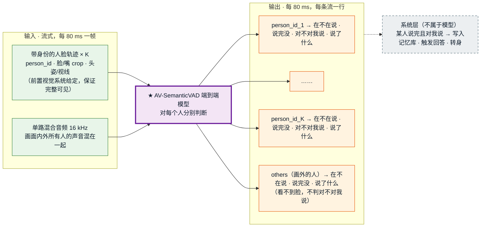
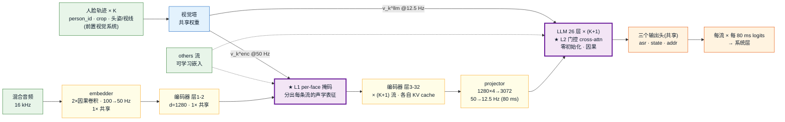
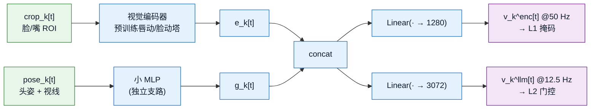
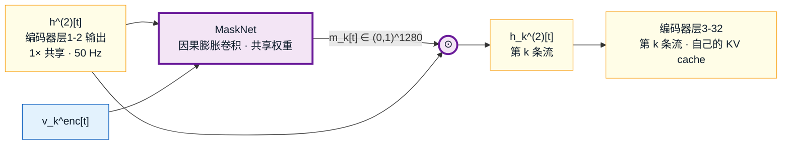

# 模型架构 v6.2 —— forward 契约（输入 · 两级条件化 · 输出 · 运行情形）

> **本文件 = 模型契约的唯一权威。** 对外定位（new setting / 三点贡献 / 竞品口径）以
> [`cvpr-framing.md`](cvpr-framing.md) 为准，本文件不重复、也不得与之冲突。
> 旧的 v4/v5 架构文档、旧实施计划、旧 benchmark 提案已于 2026-09-21 删除（git `ac5dee1` 可取回）。
>
> **三条已拍板的根基** ✅
> - **骨干 = X2-Turn（Voxtral 流式版，X2-Turn-4B-0812）**，Route A 热启动（cvpr-framing §8）。
> - **★ 两级条件化**（v6.2 新）：视觉既在**音频编码器浅层**做 per-face 掩码（管分离/ASR），
>   又在 **LLM 层**做门控 cross-attn（管状态/addressee）。batch 维 = 流数。
> - **流的集合 = 画面内 K_t 张脸 ＋ 一条常驻 `others` 流**，恒 ≥ 1 条。
>
> **★ 模型边界（2026-09-24 拍板）✅**：**身份不归模型管。** 新客/熟人判定、re-ID、`person_id`、名字
> 全部由**前置视觉系统**在进入模型之前给定。模型只负责每个人的
> **{在不在说 · 是否在对我说 · 说完没}**（外加 ASR 文本）。
>
> **★ 人脸输入假设（2026-09-24 拍板）✅**：**传进来的每张脸都是稳定、完整可见的。**
> 只要前置系统给出某个 `person_id`，这一帧他的脸就一定完整露出（不遮挡、不背身、不模糊）；
> 看不清的脸由前置系统负责**不传**。因此输入里**没有 `valid` 标记**，模型不处理遮挡。
>
> **★ 资源前提（2026-09-24 拍板）✅**：人力、物力、算力充足，**数据不是问题**（详见 cvpr-framing 文首）。
> 本文件的设计取舍一律**不以数据量 / 算力为约束**；下文凡与 AMI 规模对比处，只作为参照系，不作为风险。
>
> 标记：✅ 已定 ｜ 💡 建议待拍板 ｜ ⏳ 待实验定 ｜ ⚠️ 风险
>
> **最后更新**：2026-09-24（v6.2；补资源前提，§8.5 改写；新增 §0 端到端总览；状态改为 X2-Turn 6 类）

---

## 0. 端到端总览（自顶向下 · 先把模型当黑盒）

> 本节只回答一件事：**模型吃什么、吐什么。** 内部怎么拆，从 §1 起逐层展开。



### 0.1 输入

| 输入 | 内容 | 来源 |
|---|---|---|
| **人脸轨迹 × K**（K 可为 0，随人进出变化） | 每张脸：`person_id`、脸/嘴 crop、头姿 + 视线。**传进来的脸一定完整可见** | 前置视觉系统（检测 + 跟踪 + 认人），**身份在进模型前已确定** |
| **混合音频** | 单通道 16 kHz，画面内外所有人的声音 | 麦克风（阵列先降成单路） |

### 0.2 输出（每条流 × 每 80 ms）

流 = 画面内 K 张脸各一条 ＋ 一条常驻 `others`（画外的人），共 K+1 条。

| 输出 | 取值 | 回答的问题 | 实现（§4） |
|---|---|---|---|
| `person_id` | 原样透传 | 这一行是谁 | 不参与计算 |
| 状态 | 沿用 X2-Turn 6 类：`idle` / `noidle` / `speaking` / `turn_end` / `backchannel` / `uncertain` | **在不在说 · 说完没 · 是不是附和** | `state_logits`，6 类单头（§4.1） |
| addressee | `对我说` / `不对我说` / 弃权 | **是不是在对机器人说** | `addr_logits`；`others` 弃权（看不到脸） |
| 文本 | 这一帧新增的 1 个 token；没有新字时为空（PAD） | **说了什么**（系统层按人拼接成句） | `asr_logits`，每人一条独立 ASR |

```json
// 某一 80 ms 帧的输出示例（K=2）
[
  {"person_id": "p_0042", "state": "turn_end",    "addressee": "对我说",   "text_delta": "奶"},
  {"person_id": "p_0043", "state": "backchannel", "addressee": "不对我说", "text_delta": "嗯"},
  {"person_id": "others", "state": "idle",        "addressee": "弃权",     "text_delta": ""}
]
```

> 模型**到输出为止**。"什么时候回应、回应谁、写不写记忆库"都在系统层（见 cvpr-framing「业务闭环」）。

### 0.3 往下怎么拆（阅读路线）

| 层级 | 看什么 | 位置 |
|---|---|---|
| L0 · 黑盒 | 输入 / 输出 | **本节** |
| L1 · 模块图 | 视觉塔、音频编码器、两级视觉注入（L1 掩码 / L2 门控）、三个输出头怎么连 | §1 |
| L2 · 模块细节 | 输入参数 → 每个模块内部 → 输出头 | §2 → §3 → §4 |
| 运行时行为 | 画面 0 / 1 / 多人时每条流输出什么 | §5 |
| 训练 · 单测 · 风险 | 怎么训、测什么、哪里会坏 | §6 → §8 |

---

## 版本演进（为什么会有 v6.2）

| 版本 | 视觉注入位置 | 被推翻的理由 |
|---|---|---|
| v5 | 骨干**之后**，在 `H[t]` 上做 per-face cross-attn 读出 | 给不了 per-face ASR；完整性读自混合 hidden（撞噪声 gate 的 0.47） |
| v6 / v6.1 | **LLM 层**逐层零初始化门控注入 | ⚠️ **仍然太晚** —— 见 §3.0。音频编码器仍冻结、仍盲处理混音，且已 4× 降采样到 12.5 Hz |
| **v6.2** | **编码器浅层掩码 ＋ LLM 层门控**（两级） | 当前版本 |

**v6.2 的触发**（2026-09-22 文献调研，§9）：多说话人 ASR 领域的四类主流架构，
**无一例外把说话人线索注入在声学层或编码器状态**，没有一个放在编码器下游的语言模型里。
我们 v6/v6.1 恰好放在了后者。

---

## 1. 一页纸总览



**一句话**：混合音频的浅层声学表征被每张脸的视觉**掩码分离**，分离后的 K 条流各自过骨干，
再在语言层被同一张脸的视觉**二次条件化**，输出 per-face 的 `{ASR · 状态（X2-Turn 6 类） · addressee}`；
另有一条常驻 `others` 流兜住画外声音。

---

## 2. 输入契约 ✅

### 2.1 音频（全部参数已在代码核实）

| 项 | 值 | 依据 |
|---|---|---|
| 形态 | **多人混合**单通道波形，16 kHz | cvpr-framing §1（不用麦阵 / DoA） |
| mel | `num_mel_bins=128`，hop 160 → **100 Hz** | `config.json: audio_config` |
| embedder | `conv1` k=3 s=1；`conv2` k=3 **s=2** → **50 Hz / 20 ms** | `VoxtralRealtimeEmbedder`（`modeling_voxtral_realtime.py:415-431`） |
| 编码器 | **32 层**，`hidden=1280`，`sliding_window=750`（≈15 s @50 Hz） | 同上 + `config.json` |
| 因果性 | ✅ 已是因果：`VoxtralRealtimeCausalConv1d` + `create_sliding_window_causal_mask` | `modeling_voxtral_realtime.py:212, 581` |
| projector | `Linear(1280×4 → 3072)`，4 帧并一组 → **12.5 Hz / 80 ms** | `VoxtralRealtimeMultiModalProjector`（`:854-858, 925-926`） |
| LLM | **26 层**，`hidden=3072`，`vocab=131072` | `config.json: text_config` |
| 前瞻延迟 | `default_num_delay_tokens=6` → **480 ms** | `inference.py:122`；对齐规则 §3.4 |

> **★ 两个帧率，别混**：编码器内部是 **50 Hz（20 ms）**，LLM 是 **12.5 Hz（80 ms）**。
> 视觉要**同时**产出这两个速率的 token（§3.1）。写错就是静默错位。

### 2.2 视频

| 项 | 值 |
|---|---|
| 形态 | **单目 RGB**，多人同框 |
| 前置模块（冻结） | 人脸检测 + 跟踪 → 第 t 帧 `K_t` 条稳定轨迹 |
| 每条轨迹产出 | ① 脸/嘴 ROI crop；② 头姿 + 注视向量；③ **`person_id`**（前置视觉系统已完成认人/re-ID） |
| `person_id` 的用法 | **只作为流的标签透传到输出**，不进入任何计算；模型不做认人、不存身份 |
| 时间对齐 | 视频 25–30 fps → **上采样到 50 Hz**（给编码器）＋ **池化到 12.5 Hz**（给 LLM） |
| `K_t` | **变长**，0 起步，允许人中途进出（§3.6） |
| **流的总数** | `K_t + 1`（K 张脸 ＋ 常驻 `others`），**恒 ≥ 1** |

---

## 3. 中间流程

### 3.0 ★ 为什么必须两级：v6/v6.1 的注入位置错了

**文献的一致做法**（§9 有完整出处）：

- Whisper-Sidecar 把分离器插在**编码器第 2 与第 3 块之间**，理由是
  "the ASR encoder captures more acoustic information in its **lower layers** and more linguistic
  information in the upper layers"。
- NVIDIA 四类架构里，masked input 在 "**audio feature input level**" 注入；
  WL-SOT 把 diarization 预测 "embedded into the **ASR encoder state**"；SSA 建在流式 ASR 模型内部。
- MISP 在**信号级**用 GSS 引导分离。

**没有任何一个把说话人线索放在编码器下游的语言模型里。而 v6/v6.1 正是这么做的。**

**为什么这在我们这里格外致命**：视觉条件在 v6.1 里进入 LLM 时，音频已经
① 被一个单说话人语料训出的 **32 层编码器**压过；② 被 **4× 降采样到 80 ms/帧** ——
音素率约 10–15/秒，**一帧里塞着两个说话人交错的音素**。

⚠️ **而且我们自己的探针可能一直在警告这件事**：噪声 gate 那个 **0.47** 测的就是 LLM 的 hidden，
即编码器**之后**。那个数字的含义可能不是"混音难判"，而是"**信息在到达那里之前就已被抹掉**"。
若如此，"在 LLM 层注入视觉"与"在 LLM 之后读出"（消融臂 A）差别很小 —— 两者都在往一个已塌的表征上加条件。

**修正 = 两级分工**，与我们的第一原则一致：

| 级 | 位置 | 职责 | 对应的模态分工 |
|---|---|---|---|
| **L1** | 编码器浅层（层 2 后） | **声学分离**：把混音里属于这张脸的部分掩出来 | 视觉做**归属** |
| **L2** | LLM 各层 | **语义条件化**：说话状态 + addressee | 音频做**内容/完整性**，视觉给**朝向** |

⏳ **注入深度本身是待测超参**，不是信仰：恢复实验的主轴就是它（§8.1）。

### 3.1 视觉塔 💡（选型待拍板，接口已定）



- 编码器候选：💡 **AV-HuBERT 视觉前端**（唇动，96×96 ROI，输出序列表征，原生 25 fps 便于上采样到 50 Hz）
  vs Light-ASD / TalkNet（ASD 预训练，但输出偏二分类 logit，不适合当条件源）。
- **注视/头姿走独立支路**，不能被唇动塔吞掉 —— addressee 轴只靠它。
- ⏳ 两条投影是否共享主干、`v^enc` 每帧几个 token，实现期定。

### 3.2 L1 · 编码器浅层 per-face 掩码（v6.2 新）💡



```
h^(2) = 编码器层1-2( embedder(mel) )              # 1× 共享，d=1280 @50Hz
掩码:  m_k[t] = σ( MaskNet( h^(2)[t], v_k^enc[t] ) )     ∈ (0,1)^1280
分流:  h_k^(2)[t] = h^(2)[t] ⊙ m_k[t]
每流:  H_k^enc = 编码器层3-32( h_k^(2) )           # K× ，各自 KV cache
```

- `MaskNet` = Conv-TasNet 风格的因果 1-D 膨胀卷积堆（Sidecar 的做法），**因果**、共享权重。
- **零初始化保证**：`MaskNet` 末层零初始化 + 残差形式 `m_k = 1 + tanh(α)·Δ`，`α` init 0
  → 初始 `m_k ≡ 1`，**逐比特等于纯 X2-Turn**（§7.1 单测）。
- **实现可行性已核实**：`VoxtralRealtimeEncoder.forward` 是裸 `for encoder_layer in self.layers`
  循环（`modeling_voxtral_realtime.py:592`），拆成两段即可；卷积 `padding_cache` 在 embedder 里
  → **1× 共享**；每条流只需自己的 `past_key_values`。

### 3.3 L2 · LLM 层门控 cross-attn（v6.1 保留）✅

```
第 k 条流、LLM 第 ℓ 层（每 N≈4 层插一个）:
    h ← h + tanh(α_ℓ) · CrossAttn(Q = h, K = V = v_k^llm[≤t])      α_ℓ init 0
```

- **因果**；`α=0` 时该级无贡献。
- **流间不共享、不通信**：没有任何 cross-face 注意力（§3.5）。
- `others` 流同构，条件来自可学习嵌入（§3.7）。

### 3.4 ⚠️ 时间对齐（最容易静默写错的地方）

**L2 与状态读出只用一条索引规则**，不发明第二套：

```
prediction_index = prefix_length + frame_index - 1        # inference.py:165，next-token 语义
```

→ 墙钟帧 `i` 的 `v_k^llm` 注入到 LLM 位置 `prefix_length + i - 1`，与音频帧、状态读出**同一位置**。
`num_delay_tokens=6`（480 ms）内生在音频特征排布里，视觉按同位置注入即自动获得**同样的前瞻**。

**L1 的对齐是另一套**：编码器内部 50 Hz，`v_k^enc` 必须按 **20 ms** 网格对齐，
且 1 个 LLM 帧 = **4 个编码器帧**。⏳ 视频 25 fps → 50 Hz 用重复还是插值，实现期定。
两级的错位都由 §7.2 的脉冲响应单测分别兜住。

### 3.5 为什么不加 cross-face 归一化 ✅

诱惑是在流之间做 softmax（"这帧属于谁"）。**不做**：

1. 真重叠时多人同时说，"归一化到 1"是错的前提 —— 这正是 VAP 家族塌成 floor-holder 的起点。
2. **不需要**：静默脸的 ASR 标签是**全 PAD**（§6.3），竞争信号从标签进来，不必从结构进来。

### 3.6 流的生老病死 ✅

| 事件 | 处理 |
|---|---|
| 新轨迹出生 | **新开一条流**，编码器层3-32 与 LLM 的 KV cache 均从当前时刻冷启动 |
| 轨迹存活 | 增量解码，维护自己的两套 KV cache |
| 轨迹丢失（前置系统不再传这个 `person_id`） | 该流**销毁**，两套 cache 释放 |
| 人离开又回来 | **新开一条流**（KV cache 冷启动）；身份由前置系统给回同一个 `person_id`，输出照常挂在他名下。模型自身不做 enroll / re-ID |

⚠️ 新流冷启动拿不到出现之前的上下文；前几百 ms 判决不可信 → 系统层按 uncertain 处理。

### 3.7 ★ 常驻 `others` 流（画外说话人）✅ + v6.2 的降级

**定义**：除画面内 K 张脸外，恒定再开一条流，代表"声音属于某个我看不见的人"。

```
v_others^enc[t] = E_enc ,  v_others^llm[t] = E_llm     # 可学习嵌入
⏳ 建议升级: 追加「可见人脸集合」的池化表征作为减法线索（见下）
```

与人脸流**结构同构**，三处差异：

| | 人脸流 k | `others` 流 |
|---|---|---|
| 条件来源 | 视觉塔吃 crop + 头姿 | **可学习嵌入**（无脸、无注视） |
| `addressee` | 由注视/头姿决定 | **永久弃权** |
| 存在性 | 随轨迹生灭 | **常驻**，`K_t=0` 时是唯一的流 |

**它买到了什么**：① 补上归属的**完全覆盖**（v6 里"K 张脸全沉默 + 画外有人说"无流可去，音频凭空消失）；
② 把负样本监督升级为**正样本监督**；③ 消掉 `K=0` 特例。

**⚠️ v6.2 的诚实降级（相对 v6.1 收紧）**：`others` 只有**常数**嵌入，**没有时变线索**。
人脸流有唇动（与目标语音包络强相关，这是 AV-TSE 整个领域赖以工作的信号），
`others` 什么都没有 → 它实际在做**无线索盲分离**。

> **因此 `others` 的能力边界重新定义为**：
> - ✅ **检测**："有个看不见的人在说话 / 他（没）说完" —— 在**非重叠**时可信；
> - ⚠️ **转写**：重叠时**不保证质量**，系统层一律按低置信处理；
> - ❌ **多个画外说话人**：压成一条流，此时表征又是混合的，completeness 不可信。
>
> v6.1 曾写"3e 结构上就是 3b 的特例"——**这句话是轻率的**，`others` 比任何人脸流都难。

💡 **建议提级（原为 ⏳）**：给 `E_others` 追加"**当前可见人脸集合的池化表征**"作为条件。
这是它唯一能拿到的有信息量的线索（"排除这些人之后的残差"），置换不变、不破坏 §3.5 的无归一化原则。
❌ **不采纳**的方案：给 `others` 累积式说话人记忆（声纹 cache）—— 与"不用声纹"的设定冲突。

**与"纯音频降级"的关系（两件事，别混）**：

| 触发 | 行为 |
|---|---|
| 视觉可用但画面无人（`K_t=0`） | `others` 带可学习嵌入运行 —— "没人露面，但有人在说" |
| 视觉**整体失效**（相机故障/全黑/前置模块崩） | 全部 `v := 0`、全部 `α := 0` → **逐比特退化为纯 X2-Turn** |

后者才是降级保证，也是 §7.1 恒等性单测测的东西。⚠️ `E_others ≠ 0`，
所以"`K=0` 的 others 流"**不等于**纯 X2-Turn。

### 3.8 ★ 一个我们真有的结构优势：视觉消解了排列歧义

PIT、SOT、以及 NVIDIA 专门发明的 **PI-DTW**，存在的**全部理由**都是解决说话人排列歧义 ——
纯音频系统不知道第一条输出该对应哪个人。

**我们有 `track_id`，排列歧义天然不存在。** 视觉提供了 canonical 的归属锚点。
这是视觉条件相对 diarization 条件的**结构性好处**，值得写进论文。
**代价**：标注必须把每句话绑到人脸轨迹上（§6.4）。

---

## 4. 输出契约 ✅（forward 只吐 logits）

对每条流 `k ∈ {face_1..face_{K_t}} ∪ {others}`、每个 80 ms 帧 `t`：

| 输出 | 形状 | 实现 | 热启动 |
|---|---|---|---|
| `asr_logits` | `[B,K+1,T,131072]` | 复用 `base_model.lm_head` | ✅ 继承 X2-Turn |
| `state_logits` | `[B,K+1,T,6]` | **新** `Linear(3072,6,bias=False)` | ✅ 拷 `vad_lm_head` 第 35–40 行（6 行全拷） |
| `addr_logits` | `[B,K+1,T,2]` | **新** `Linear(3072,2,bias=False)` | ❌ 随机；`others` 行永久弃权 |

三个头在人脸流与 `others` 流之间**共享权重**。

### 4.1 状态：沿用 X2-Turn 6 类 ✅（2026-09-24 改，取代原三态）

| id | 类 | 含义 | 业务上怎么用 |
|---|---|---|---|
| 35 | `idle` | 没在说话 | — |
| 36 | `noidle` | 有声音但无语义（清嗓、咳嗽、开口前的"呃"） | 不能打断机器人 |
| 37 | `speaking` | 在说有语义的话，还没说完 | 在说；机器人说话时可打断 |
| 38 | `turn_end` | **说完了**（持续 1–2 帧的**事件**，之后回到 `idle`） | 触发回答 = **语义完整性** |
| 39 | `backchannel` | 附和（"嗯嗯""对""好的"） | 不打断、不回答、不写记忆库 |
| 40 | `uncertain` | 拿不准 | 系统层按低置信处理 |

**为什么不用原三态** `{静默 · 说话-incomplete · 说话-complete}`：
1. 原三态把 `turn_end` 当成持续状态，但在 X2-Turn 里它是**说完那一刻的 1–2 帧事件**
   （`README.md:125-126`：说话 → `turn_end` → `idle`），标签定义与热启动来源对不上。
2. 原三态丢掉了 `noidle` / `backchannel` / `uncertain`，而这三类正是 X2-Turn 控制器判断
   "能不能打断、是不是附和"的依据（`turn/controller.py` 顶部规则）。

**热启动**：`vad_lm_head` 是 `lm_head` 的整词表拷贝，只有 id 35–40 有意义（`modeling.py:15-23`）：

```
state_head.weight[0:6] ← vad_lm_head.weight[35:41]   # 6 行全拷，顺序与 TURN_CLASS_NAMES 一致
```
→ day-0 就等于 X2-Turn 原头。探针 A（0.99）已证完整性在 hidden 里**线性可读**。

**业务三问在系统层推导**（每个人各跑一份 X2-Turn 现成的 `FrameTurnController`）：
- **在不在说** = `speaking` / `turn_end`（附和与杂音不算）
- **说完没** = 出现 `turn_end`
- **附和** = `backchannel`；⚠️ 机器人刚问完问题时，"嗯"是**回答**不是附和 —— 由控制器结合机器人状态改判，不归模型。

**论文口径不变**："语义完整性"落在 `turn_end`（它属于 X2-Turn 的 `SEMANTIC = {speaking, turn_end}` 集合）。

### 4.2 判别式，不走生成式 ✅
状态**不占词表槽位、不进 text 流**。低延迟、不 generate、K 个头并行、评测直接出 AUC、可独立降级。

### 4.3 per-face ASR 流 ✅
第 k 条流的 text 流就是第 k 张脸的转写；静默时输出 `STREAMING_PAD_ID`（`inference.py:22` = 32）。
**这条流是 L1 掩码是否真的在分离的直接证据**（§6.3）。

### 4.4 addressee ✅ + 弃权规则
per-face 二分类 `{对系统说 · 不对系统说}`，与状态正交。
**⚠️ 硬规则**：`others` 流的 `addr_logits` **永久丢弃**。注视信息只存在于视觉，`others` 没有脸，
该头只能从音频 hidden 编造。人脸流按输入假设总是完整可见，不需要弃权。

### 4.5 系统层（不属模型 forward）
`state` × `addressee` × `ASR 文本` → "该不该现在回应他 / 回应谁"。
阈值、迟滞、uncertain 兜底、多脸同时 complete 的仲裁，全在系统层。

---

## 5. 运行情形

> **统一机制，无 if-else 分支。** 流的集合恒为 `{K_t 张脸} ∪ {others}`，恒 ≥ 1 条。
> 三种"情形"只是 `K_t = 0 / 1 / ≥2` 的取值；真正在变的是**这段音频落到哪条流上**。

### 5.1 情形 1 · 画面无人（`K_t=0`，流数 1）
唯一的流是 `others`。输出 `{track_id:"others", state, text, addressee: 弃权}`
—— "有个我看不见的人在说话，而且他（没）说完"。
⚠️ 画外若多人同说，`others` 拿到的是混合表征 → 低置信。

### 5.2 情形 2 · 画面单人（`K_t=1`，流数 2）

| 子情形 | `face_1` | `others` | 靠什么 |
|---|---|---|---|
| **2a · 音频是他发的** | `✎` state∈{speaking, turn_end, backchannel, noidle}、ASR=他的话、addressee 由注视定 | `·` | 探针 A regime（0.99） |
| **2b · 音频来自画外**（他沉默） | `·` `idle` + 全 PAD | `✎` | **只能靠视觉**：唇不动 ⇒ 判"不属于我" |

> **★ 2b 是条件化是否真的生效的判据。** 未正确训练的模型会把听到的任何语音转写到眼前唯一那张脸上。
> 三道防线：① 训练集含"脸在画面、音频来自他处"样本；② 静默脸 ASR 全 PAD（负向）；
> ③ **`others` 有正向目标**。⏳ 必须进恢复实验评测集。

### 5.3 情形 3 · 画面多人（`K_t=K≥2`，流数 K+1）

| 子情形 | 期望输出 | 把握 |
|---|---|---|
| **3a · 一人说，其余静默** | 说话者 `✎`；其余脸 + `others` `·` | 归属任务，探针 B 已证视觉可做（0.649 vs 0.25） |
| **3b · 两人及以上重叠** | 各流分别提取；`others` `·` | ⚠️ **最难，C2 的判据**。见 §5.5 的预期与边界 |
| **3c · 无人说话** | 全部 K+1 流 `·` | 噪声**不**进 `others`（§3.7 限制条款） |
| **3d · 画外有人说，K 张脸沉默** | 脸全 `·`；`others` `✎` | v6 的洞，v6.1 补上 |
| **3e · 画内画外同时说** | 对应脸 `✎`；`others` 同时 `✎` | ⚠️ **v6.2 明确降级**，见 §5.5 |

**两条不变量**：**置换等变**（流间无通信 ⇒ 结构上天然成立，`others` 恒在末位不参与置换）；
**不强制划分**（允许 0 条或多条流同时说话）。

### 5.4 一张表看全
`✎` = 出文本 + 说话类状态（`speaking`/`turn_end`/`backchannel`/`noidle`）；`·` = `idle` + 全 PAD；`—` = 不存在

| 情形 | `K_t` | face 流 | `others` | 备注 |
|---|---|---|---|---|
| 1 · 画面无人，画外有人说 | 0 | — | `✎` | 唯一的流 |
| 1' · 画面无人，无人说 | 0 | — | `·` | |
| 2a · 单人，他在说 | 1 | `✎` | `·` | 探针 A regime |
| 2b · 单人沉默，画外有人说 | 1 | `·` | `✎` | ★ 条件化判据 |
| 3a · 多人，一人说 | ≥2 | 一条 `✎`，其余 `·` | `·` | 归属任务 |
| 3b · 多人重叠 | ≥2 | 多条 `✎` | `·` | ★ C2 判据 |
| 3c · 多人，无人说 | ≥2 | 全 `·` | `·` | 噪声也走这里 |
| 3d · 多人沉默，画外有人说 | ≥2 | 全 `·` | `✎` | v6 的洞 |
| 3e · 画内画外同时说 | ≥2 | 部分 `✎` | `✎` | ⚠️ 降级，§5.5 |
| （任意）视觉整体失效 | — | 全 `v:=0` | `v:=0` | 逐比特 = 纯 X2-Turn |

### 5.5 ★ 对 3b / 3e 的能力边界（v6.2 明确写死）

**3b（两人及以上重叠）—— 能做到"可用"，做不到"干净"。**

参照系（§9）：合成两人混音最好 **4.66% WER**（Whisper-Sidecar / Libri2Mix）；
真实会议流式最好 **16.18% cpWER（oracle）/ 23.36%（估计）**（NVIDIA SSA）。
而那些系统用的是 **1 秒以上**上下文、**数千至数十万小时**训练数据。
数据量可以通过自采补齐（见文首资源前提），剩下的硬约束是 **80 ms**：上下文和前瞻都远少于它们
→ **重叠段 per-face ASR 仍很可能不如这些离线/长上下文系统**（§8.3）。

**但我们真正要的是重叠段的语义完整性**——三分类，比逐词转写宽容得多，有希望。
**前提是 L1 注入成立**；若只有 L2（v6.1），连状态都可能救不回来（§3.0）。

**3e（画内 + 画外同时说）—— 部分超出范围。**
- ✅ 画外**单人**说 + 画内说话 → 支持（`others` 无重叠，检测可信）。
- ❌ 画外说话 **且** 画内重叠同时发生 → **明确列为超出范围**，系统层输出 uncertain。
  硬撑这个情形会在审稿时变成软肋，不如写清边界。

---

## 6. 训练契约

### 6.1 阶段
- **S1**：冻骨干（含音频编码器），只训 **视觉塔 + L1 MaskNet + L2 门控 + 三个头**。
  两级的 `α` 都从 0 长起来。验收：归属/状态可读、ASR 不坏、恒等性单测仍过。
- **S2**：骨干开 **LoRA r=32**（数据量足则全微调）→ 联合训。
- ⏳ **是否分两小步**（先只开 L2、再开 L1）留作实现期消融，与 §8.1 的注入深度实验共用。

### 6.2 损失
```
L = L_asr + λ_s · Σ_k L_state(k) + λ_a · Σ_k L_addr(k)
```
- `L_state` 类加权：**`speaking` 被误判为 `turn_end`（= 抢话）代价最高**；
  其次是 `backchannel` 被误判为 `speaking` / `turn_end`（= 被附和打断）。
- `L_addr` 只在**人脸流**上算；`others` 不计。
- ⚠️ `others` 的 `L_state` / `L_asr` 需**下调权重或类平衡**，防垃圾桶化（§8.4）。
- **视觉 dropout `p≈0.3`**（整段置零）→ 降级从结构保证升级为统计保证，
  同时批量制造情形 1，让 `others` 路径被真正训练。

### 6.3 ★ 标签：每帧语音都要有归宿，其余流一律全 PAD
```
face k 帧 t 没说话   ⇒ asr_label[k,t] = STREAMING_PAD_ID   且 state_label[k,t] = idle
face k 帧 t 出声     ⇒ asr_label[k,t] = 他自己的词 token   且 state ∈ {noidle, speaking, turn_end, backchannel}
others 帧 t 无画外音 ⇒ asr_label[o,t] = STREAMING_PAD_ID   且 state_label[o,t] = idle   ← 对称，不可省
others 帧 t 有画外音 ⇒ asr_label[o,t] = 画外那句的词 token 且 state ∈ {noidle, speaking, turn_end, backchannel}
```
- **负向**（人脸流 PAD）：惩罚"抢别人的话"。若缺失，最省力解是**忽略视觉**、每条流复述混合 ASR
  —— 那恰好是消融臂 A 的行为。
- **正向**（`others` 词标签）：画外语音有明确去处。
- ⚠️ `others` 的 PAD 标签不可省，否则直接养出 §8.4 的垃圾桶解。

### 6.4 标签形态（C1 数据集接口）
每段视频 × 每 80 ms 帧 × **每条流（K 条轨迹 ＋ 1 条 others）**：
`{person_id | "others", state ∈ X2-Turn 6 类, addressee ∈ {0,1,弃权}, text token}`
＋ 段级元信息：`是否含画面外说话人`。

> **★ 对标注流程的两条硬要求**：
> ① 标注员必须能判定"这句是画内**哪张脸**说的，还是画外说的"——这是 §3.8 排列歧义优势的代价；
> ② 数据集必须**刻意包含** 2b / 3d / 3e 样本。第一人称/机器人视角下画外说话人是常态，须在录制脚本里设计。

---

## 7. 必测单测 ✅

1. **恒等性**：两级 `α` 全 0（或全部 `v:=0`）→ 输出与纯 X2-Turn **逐比特相同**。
   ⚠️ 这**不**等价于情形 1（`E_others ≠ 0`，§3.7 末表）。
2. **L2 帧对齐脉冲响应**：第 n 个 **80 ms** 帧注入视觉脉冲，响应出现在第 n 帧而非 n±1。
3. **L1 帧对齐脉冲响应**：第 m 个 **20 ms** 编码器帧注入脉冲，响应落在正确的 20 ms 格，
   且 1 个 LLM 帧 = 4 个编码器帧的换算正确。
4. **零初始化**：新模块在 step 0 的输出与梯度符合预期。
5. **置换等变**：打乱人脸顺序，输出随之置换且数值不变。
6. **变长 K**：`K = 0/1/4/8`，流数恒为 `K+1`；人进出时两套 KV cache 的新建销毁正确，`others` 恒在末位。
7. **归属行为（2b 回归）**：喂"脸在画面但不说话 + 画外语音"，
   断言 **face 流全 PAD 且 others 流出文本** —— 两侧都断言，只断言一侧测不出垃圾桶解。
8. **`others` 不吞画内语音（3a 回归）**：喂"画内某人在说、无画外音"，断言 **others 全 PAD**。

---

## 8. 风险与边界

### 8.1 ⏳ 注入深度（恢复实验的主轴，v6.2 改）
**原 A/B 二选一升级为三臂同跑**：

| 臂 | 视觉注入位置 | 含义 |
|---|---|---|
| **A** | 骨干**之后**读出 | v5 原案，最便宜的下界 |
| **B** | 仅 **L2**（LLM 层） | v6.1 |
| **C** | **L1 + L2**（两级） | v6.2 主模型 |

在 AMI 单人档 / 重叠档上跑 per-face completeness AUC + cpWER。
**这既是 C2 强弱的判据，也是注入深度的判据**，还白送 C3 要的同构消融。
⚠️ 若 C 相对 B 在重叠档没有显著增益，说明信息确实在编码器里就丢了，那时才该考虑更激进的方案（解冻编码器 / 换骨干）。

### 8.2 ⚠️ 视觉被忽略的退化解
PAD 监督不足或视觉塔容量不够 → 模型收敛到"忽略 `v_k`、每条流复述混合 ASR"。
**检测**：2b / 3d 表现；两级 `α` 的量级；L1 掩码的熵。**训练期第一指标。**

### 8.3 ⚠️ 延迟-精度可能在跟物理作对
VibeVoice 的消融是单调的：chunk 15→22 帧改善 cpWER 4.06 分；lookahead 0→4 帧从 35.88 降到 31.55。
**上下文越多、前瞻越长，归属越准**，而我们锁死在 80 ms + 480 ms。
**应对**：① 报**帧长/前瞻的 Pareto 曲线**而非单点数字；
② 说明 per-face 输出是给**话轮决策**用的，不是交付转写 —— 错一个词的代价远低于晚 2 秒决定要不要回应。
⚠️ **80 ms 是骨干自带的，不是我们的贡献**，不得当卖点写。

### 8.4 ⚠️ `others` 退化成垃圾桶
模型发现归属难，就把拿不准的语音丢进 `others`，人脸流集体摆烂输出 PAD。与 §8.2 是同一枚硬币两面。
**防线**：① `others` 无画外音时也监督为全 PAD；② 损失权重下调/类平衡；③ §7.8 守门单测；
④ 盯**画内语音被判给 `others` 的比例** —— 比总 loss 灵敏得多。

### 8.5 ✅ 数据量不是风险（2026-09-24 改；原标题"最大的实际风险是数据量"作废）
人力、物力、算力充足，训练数据可以**自采 + 自标到所需规模**。下表只作为**规模参照**，
说明自采至少要做到什么量级，才能和强 baseline 公平对比：

| 系统 | 训练数据 |
|---|---|
| Whisper-Sidecar | LibriMix / LibriSpeechMix |
| NVIDIA SSA | Fisher + LibriSpeechMix + AMI + ICSI + NOTSOFAR-1 + 单人 Granary |
| VibeVoice-ASR-Streaming | 42 万小时流式预训练 + 1.3 万小时多说话人微调 |
| 我们（现状） | AMI 4 场会议 —— **仅用于早期探针和三臂实验起步，不是最终训练集** |

数据侧剩下的只有**设计问题**：第一人称/机器人视角、人数与重叠比例分布、三轴标签定义、训练/评测切分。
MISP-Meeting（125 h、57% 重叠、带视频）等公开集作**补充与外部对照**，不再是"不得不依赖"的救命稻草。

### 8.6 成本（按核实的结构重算）
| 部件 | 倍数 |
|---|---|
| embedder（2 因果卷积，`padding_cache` 共享） | **1×** |
| 编码器层 1-2（d=1280） | **1×** |
| 编码器层 3-32（d=1280，30 层） | **(K+1)×** |
| projector + LLM 26 层（d=3072） | **(K+1)×** |

相对 v6.1 新增的是编码器 30 层的 K× —— 635M 级，相对 4B 的 LLM 不是主要开销。
`K ≥ 8` 的降级方案 = 状态头走共享前向（A 的路径）覆盖全部 K 脸，ASR 流只对 `state≠idle` 的脸开
（部署期优化，非论文主模型）。

### 8.7 ⚠️ 新颖性口径再收紧一档（v6.2）
除"AV-TSE 机制不新"（cvpr-framing §7）外，**"多实例 + 线索条件化"也已是被系统研究过的成熟范式**
（NVIDIA 把它列为四类架构之一并测出它最优）。

> **不得写**：首个视觉引导 per-face 提取/路由；首个 per-face 多流架构；首个多实例条件化。
> **能守住的**：输出是 **per-face 语义状态（完整性 + addressee）**，不是波形、不是纯转写。
> 上述四篇的输出**全部是 "who said what" 的转写，无一输出语义完整性**。

---

## 9. 文献依据（2026-09-22 调研，一手读过）

| 工作 | 与本架构的关系 | 关键数字 |
|---|---|---|
| [Whisper-Sidecar](https://www.alphaxiv.org/abs/2407.09817)（CUHK, 2024） | **L1 的直接原型**：冻结 Whisper + 编码器第 2/3 块间插 Conv-TasNet 式分离器，PIT，并行分支 | Libri2Mix **4.66% WER**；Libri3Mix 16.79% |
| [Pushing the Boundaries of Streaming Multi-Speaker ASR](https://www.alphaxiv.org/abs/2609.10265)（NVIDIA, 2026） | **四类架构的系统比较**：多实例 > 单实例；注入点全在声学/编码器状态 | SSA **16.18/23.36 cpWER**；级联 45.25/42.27；单人 WER 7.44（SSA）vs 16.95（SOT） |
| [VibeVoice-ASR-Streaming](https://www.alphaxiv.org/abs/2609.02812)（MSR, 2026） | 流式 SA-ASR 的 LLM 路线上界；**序列化输出**，非并行 per-face | 延迟 **2.0 s** 稳态 / 3.5 s 启动；lookahead 0→4 帧 cpWER 35.88→31.55 |
| [MISP 2025 Challenge](https://www.alphaxiv.org/abs/2505.13971)（USTC 等, 2025） | 最接近的视听多人评测；⚠️ 但用 **8 麦阵 + GSS + 全景相机** | 125 h、重叠率 **56.95%**；最好 AVDR **cpCER 11.56%** |

**未找到**：视频条件化的**单通道**多说话人 ASR（不用麦阵）。缝在"任务/输出"，不在"机制"。

---

## 10. 仍待决 ⏳

1. **注入深度三臂实验**（A/B/C，§8.1）—— 定 C2 强弱 + 定架构。**最高优先。**
2. **视觉编码器选型**：AV-HuBERT 前端 vs Light-ASD/TalkNet；检测跟踪器选型。
3. `MaskNet` 结构与容量；`v^enc` 每帧 token 数；门控插入间隔 `N`；`λ_s / λ_a`。
4. 视频 25 fps → 50 Hz 的上采样方式（重复 vs 插值，§3.4）。
5. `E_others` 追加可见人脸集合池化表征（§3.7，已从 ⏳ 提级为 💡 建议）。
6. 新流是否需要有界音频回放（§3.6）。
7. LoRA r=32 vs 全微调 —— 数据与算力都不设限，由实验效果定，不由资源定。
8. 数据采集设计（自采为主，§8.5；MISP-Meeting 等作补充/对照）与 addressee 标签定义。
9. 评测协议对齐 **cpWER/cpCER** + Pareto 曲线（§8.3），并把 Whisper-Sidecar /
   diarization-conditioned Whisper 加为"纯音频多实例"强 baseline。

---

## 附录 · 代码锚点

**X2-Turn fork**（前缀 `X2-Turn/voxtral-realtime/src/voxtral_realtime/transformers/`，只读）：
- `modeling.py:15-23` `TURN_CLASS_IDS/NAMES` —— §4.1 热启动取的 35–40（6 行全拷）。
- `modeling.py:37-188` `VoxtralMTP` —— 共享骨干 + 多头范式，推广为 per-face 多流多头。
- `modeling.py:60-69` —— `vad_lm_head` 拷贝 `lm_head` 的手法。
- `modeling.py:125-145` `train_vad_head_only` —— S1"冻骨干只训新模块"的现成实现。
- `inference.py:22` `STREAMING_PAD_ID = 32` —— §6.3 静默流的 ASR 标签。
- `inference.py:86` `_predict_turn` —— 判别式读出写法。
- `inference.py:118-122` —— 80 ms 帧长与 480 ms 延迟的计算。
- `inference.py:133-135, 165` —— `prefix_length` / `frame_count` / 索引偏移（§3.4 唯一规则）。

**上游 transformers**（`transformers/models/voxtral_realtime/modeling_voxtral_realtime.py`，L1 改造要读）：
- `:212` `VoxtralRealtimeCausalConv1d` —— 编码器已是因果卷积。
- `:415-431` `VoxtralRealtimeEmbedder` —— `conv2` stride=2 ⇒ **50 Hz / 20 ms**；`padding_cache` 在此，可 1× 共享。
- `:512-534` `VoxtralRealtimeEncoder.__init__` —— 32 层 `nn.ModuleList`。
- **`:592`** `for encoder_layer in self.layers` —— **★ L1 掩码就插在这个循环的第 2 层之后**。
- `:581` `create_sliding_window_causal_mask` —— `sliding_window=750`（≈15 s @50 Hz）。
- `:854-858, 925-926` `VoxtralRealtimeMultiModalProjector` —— `1280×4 → 3072`，50 Hz → 12.5 Hz。

**SoulX-Duplug**（范式参考）：`model/model.py:17/50/57/145-166` —— Projector / 80 ms token / 冻结前端 / 融合。
