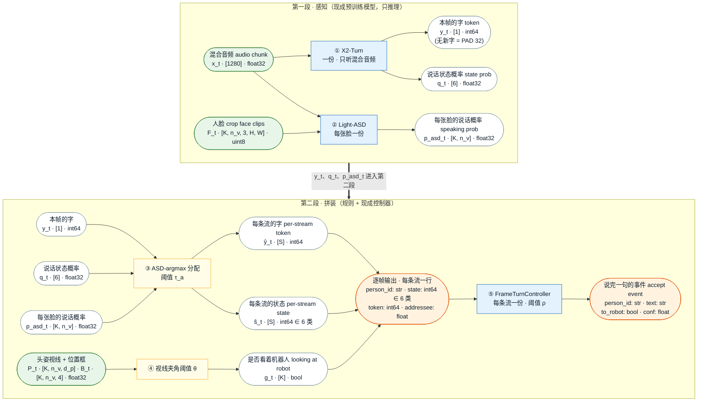

# Baseline：免训练的现成模块级联

> 全部用现成的预训练模型 + 规则拼装，不做任何训练；输入输出与 [`architecture.md`](architecture.md) §0 一致。
> 设当前是第 `t` 个 80 ms 片段，画面里 `K` 个人，共 `S = K + 1` 条流（K 张脸 ＋ 1 条 `others`）。
>
> **最后更新**：2026-09-28（ASR 与话轮状态改为直接用 X2-Turn；各模型选型后续逐个讨论）

## 各模型介绍

| 步 | 模型 / 方法 | 介绍 |
|---|---|---|
| ① | **X2-Turn**（X2-Turn-4B-0812） | 流式语音识别 + 话轮状态：只听混合音频，每 80 ms 输出一个字 token 和 6 类状态（`idle` / `noidle` / `speaking` / `turn_end` / `backchannel` / `uncertain`）；中英双语，输出对应 480 ms 前那一帧 |
| ② | **Light-ASD** | 主动说话人检测：结合声音和每张脸的唇动，判断这张脸是否在说话（AVA 预训练） |
| ③ | **ASD-argmax 分配** | 规则：每一帧 X2-Turn 的字和状态，分给这一帧 ASD 概率最高的那张脸；都低于阈值 `τ_a` 则给 `others`；其余流记为 `idle` + PAD |
| ④ | **视线夹角阈值 θ** | 规则：视线与镜头方向的夹角小于 `θ`，即判为"看着机器人" |
| ⑤ | **FrameTurnController**（X2-Turn 自带） | 每条流一份：把字拼成句子、判断说完没，说完时发出 accept 事件；`to_robot` = 这句话期间看着机器人的帧比例大于 `ρ` |
