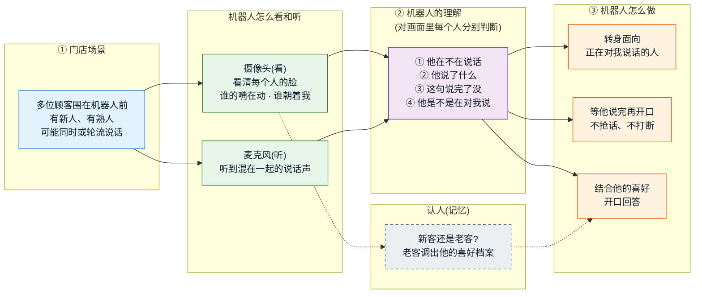
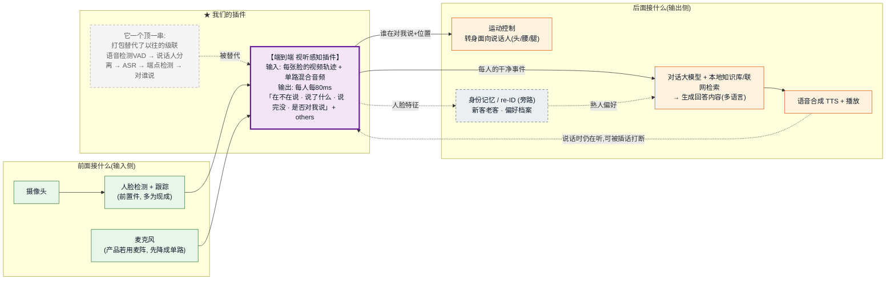

# CVPR 定位落盘：new setting · 三点贡献 · 模型结构 · baseline

> **本文件 = 2026-09-21 讨论的快照,供逐条细化。** 标记约定:
> ✅ **已定**(讨论中拍板或探针实证)｜💡 **建议待确认**(我的提案,等你逐条过)｜⏳ **待定**(需实验/更多信息)。
>
> 关联权威文档:**模型契约(输入/流程/输出)见 [`architecture.md`](architecture.md)——该文件是架构的唯一权威**;证据链与竞品裁决见
> [`implementation-execution/phase2.md`](implementation-execution/phase2.md);探针数据见 `../results/`。
> 本文件只做"对外定位"的收敛,不替代上述权威文档。

---

## 业务锚点 · 导购机器人场景与三条数据流(2026-09-23 起草,待审核)💡

> **本节 = 把 new setting 落到一个真实产品场景(门店导购机器人),供逐条审核。**
> 参照系 = 小鹏 IRON 展示的四大能力(自主朝向管理 / 动态多维身份记忆 / 多语言无感切换 / 多元智能问答)。
> 🚨 **纪律**:IRON 是产品 demo,用 **9 麦阵 + 声纹 + 云端/三芯**。**我们的论文贡献不与之对齐**——
> 我们刻意收窄到"**单目 RGB + 单路混合音频**"的更难 setting,护城河仍是 **per-face 语义完整性**(§1)。
> 本节只界定"业务要什么、我们的模型供什么、什么归系统层/正交模块",**不扩张新颖性口径**。

### 场景

门店里**新人与熟人同时入画**,机器人第一人称视角。核心业务动作:认出**谁在对我说话**、听懂他**说完没**、
(对熟人)调出偏好档案作答、并**转身面向**当前说话人。→ 天然是**多人同框 + 流式 + 第一人称**,正是本项目的
new setting;且"对谁说"(addressee)在这里不是可选项,而是**驱动机器人转向的必需信号**。

### 三条数据流(业务视角 · 横版)



> 图里"②机器人的理解"是本项目的核心(对**每个人**同时判 4 件事);"认人/记忆"是**旁边的独立模块**(虚线),不在核心里。

### 插件怎么装进技术流程(前面接什么 · 后面接什么 · 横版)



> **一句话**:插件**前面**接传感器与人脸跟踪(把画面切成一张张脸)、**后面**接对话大模型/运动控制/语音合成;
> 它自己吃掉的是**过去那段最脏的级联**(VAD+分离+ASR+端点+addressee)。上下游都是**现成组件**,我们只定义接口。


### IRON 四能力 → 落到我们哪里(哪些是本文、哪些是正交模块)

| IRON 能力 | 落到我们哪里 | 状态 |
|---|---|---|
| 自主朝向管理(声辨位 + 唇动锁人 + 转向) | 归属由**视觉**做(**非 DoA**);转向在**系统层**消费 addressee | ✅ 覆盖(机制不同) |
| 动态多维身份记忆(认人、新人/熟人、偏好档案) | **正交模块**:人脸 re-ID + 对话记忆;**不进 per-face forward**(architecture §3.6 明确不 enroll/re-ID) | 💡 非本文贡献 |
| 多语言无感切换 | 骨干 / ASR 头能力,**非架构轴** | ⏳ 看骨干多语言支持 |
| 多元智能问答(本地库 + 联网) | **系统层**应答生成,消费 per-face 输出 + 身份档案 | ✅ 系统层 |

**净结论(待审核)**:导购场景把 new setting 坐实为真实产品,并让 **addressee 从"第 4 个输出"升级为"驱动转向的必需信号"**;
但它也带进两个**我们刻意不做、须归为系统层或正交模块**的东西——**麦阵/DoA** 与 **身份记忆/re-ID**。
论文护城河不变:**per-face 语义完整性**(§1)。产品要"新人/熟人",那是记忆模块的事,**不改模型 forward、不进新颖性口径**。

---

## 0. 一句话

> 在**多人同框、流式**的新 setting 下,对画面内**每个人**逐 chunk 联合判
> **{在不在说 · 说了什么(ASR) · 说完没(语义完整性) · 是否在对"你"(系统/机器人)说话}**;
> 视觉负责**归属/分解 + 朝向(addressee)**,音频负责**内容与完整性**。
> 目标会议 **CVPR 2027**。

---

## 1. New setting(三条腿共同的地基)✅

**定义**:流式、因果(80ms/chunk)、多人同框;输入 = **多人混合音频(16kHz) + 单目 RGB**;
对画面内每个人逐 chunk 输出 `{active · ASR · complete/incomplete · addressee(是否在对我说)}`。
**交互对象假设在画面内**(不用麦阵/DoA/朝向)。**单目 RGB 天然是机器人第一人称视角**
→ "注视/头姿朝向摄像头 ≈ 在对我说话",与输入假设自洽。

> **★ 措辞放宽(2026-09-22,随架构 v6.1)**:原写"假设人一定在画面内、不做画面外"。
> 架构已引入**常驻 `others` 流**兜住画外语音(见 [`architecture.md`](architecture.md) §2.6),
> 所以正确措辞是:**要交互的人假设在画面内;画外语音不被忽略,而是显式归入 `others` 残差桶、
> 不参与 per-face 判决**。这是**鲁棒性机制,不是新颖性轴**——论文里**不得**把它写成贡献,
> 只在方法与限制里交代。它顺带堵掉一个必被问到的审稿问题("有人在画面外说话怎么办")。

**新在哪(护城河,必须精确)**:关键新轴 = **per-face 语义完整性**——
"谁在说 **且** 他这句话语义闭合了没",作为多脸同框、chunk 级、流式、**每张脸独立**的联合输出。
**addressee(是否在对系统说话)作为第 4 个 per-face 输出并入**,共同构成"该不该现在回应他"的完整判据。

**视觉的两个职责(都由 RGB 驱动,且都是音频给不了的)**:
- **归属/分解**(谁的嘴在动):把混合音频还原到人 —— 使 per-person 完整性变得可判。
- **朝向/addressee**(注视/头姿朝向摄像头):判是否在对系统说话 —— 这是**视觉真正携带信号**的一轴
  (探针 B 里注视/头姿是唯一有方向性的线索),恰好补上"视觉凭什么进 CVPR"这一软肋
  (纯归属 ≈ 现有 ASD,不够新)。

**为什么非视觉不可(开篇必须讲死)**:单块混合音频在多人重叠下算不出 per-person 完整性
(噪声 gate 剔时长后 AUC 0.77→**0.47**),必须靠视觉把混合**分解到人**;
且"在对谁说"这一信息**只在视觉里**(注视/朝向),音频无从判断。
→ 视觉的职责是**分解 + 朝向**,不是**感知完整性**(探针 B 已证视觉直接读完整性 ≈随机 0.42)。

**措辞纪律(不可犯)**:
- ❌ 不能写"AV 多人话轮预测"(MuVAP 占了行为轴)。
- ❌ 不能写"视觉改善语义完整性"(自己的探针 B 否了)。
- ✅ 永远钉在 **"per-face 语义完整性" + "视觉做分解不做感知"**。

**待堵的最后漏洞** ✅ **已核实(2026-09-21)**:核实 2024–2026 有无 ASD 工作已输出 per-face
"is-speaking + is-done"。**结论:缺口成立**,详见 §6。唯一措辞收紧 = "done" 必须限定为
**语义完整(semantic)**,不能写成 behavioral end-of-turn(后者已被 Triadic-VAP / Fast-When 部分占)。

---

## 2. 三点贡献(dataset · model · benchmark)

标准的"新 setting → 数据集 + 模型 + benchmark"三条腿。三者必须**互不冗余**、各自能单独成立。

### C1 数据集 ✅(保底,不依赖实验)
**AVSC-Corpus:首个带 per-face 语义完整性标注的多人 AV 语料。**
- 卖点 = 数据资产:规模、**三轴标注**(active-speaker 轴 × 语义完整性轴 × **addressee 轴**)、
  标注流程/一致性、许可。
- 论证:唯一真语义完整性源 GRASS 是纯音频/德语/95min → 无现成语料能训此任务,自建必需。
- ⚠️ **addressee 轴的数据代价**:标注成本上升;且 addressee 需**第一人称/机器人视角**数据——
  AMI(第三人称房间机位、无机器人对象)**能验归属+完整性恢复,给不了 addressee 标签**
  → 更坐实自采需求。数据方案见 §5.5。

### C2 模型 💡(headline 候选,但强弱押在恢复实验)
**视觉引导 per-face 分解的端到端模型。**
- 卖点 = **分解/路由机制**(不是"end-to-end"这个词本身):每张脸 visual token 作 query,
  在联合 AV 表征上把混合音频里属于他的部分拎出来,从而恢复 per-person 完整性——
  这是级联 pipeline 因**误差累积**做不到的。
- ⚠️ **依赖判据**:重叠段恢复实验(phase2.md §2.2)。重叠档视觉若抬不回完整性,
  C2 从 headline 降级为"strong AV baseline",论文退回两条腿(C1+C3)。
- 🚨 **新颖性风险(2026-09-21 核实,见 §7)**:"视觉线索把某人从混音里拎出来"= 成熟领域
  **AV-TSE / AVSE**(CueNet/Plug-and-Steer/Multi-View AVTSE…),**机制不新**。
  → **口径必须从"架构新"改到"任务/输出新"**:输出是 **per-face 语义状态(不是波形)**、
  端到端接音频-LLM 联合出状态+ASR;C2 定位 = **新任务的首次系统实现 + strong AV baseline**,
  **绝不写**"首个视觉引导 per-face 提取/路由"。

### C3 benchmark ✅(保底,不依赖实验)
**首个多人 per-face 双轴评测床 + 现有 SOTA 的失败诊断。**
- 卖点 = 任务协议 + 指标 + baseline 结果(**与数据集切开**):
  评测协议(per-face completeness AUC、错误打断率、**单人档 vs 重叠档分层报告**)、
  把 MuVAP / AV-Dialog / 级联 ASD 适配过来当 baseline、**证明它们在新轴上系统性 fail**。
- 判据(确保和 C1 不冗余):拿掉数据集,benchmark 仍有独立价值(协议 + 现有方法失败诊断);
  拿掉 benchmark,数据集仍可被别人用。两个都"能"→ 两条腿才立得住。

**依赖顺序**:C1、C3 先落地(保底);C2 跑完恢复实验再定强弱。

---

## 3. 主要模型结构(摘要 —— 细节见 architecture.md)

> ⚠️ **本节只留摘要。** forward 契约的唯一权威是 [`architecture.md`](architecture.md)(现行 **v6.2**)。
> 原 v5 结构图("共享一次前向 + 事后 per-face 读出")**已被推翻**,不要再引用。

**已定** ✅
- 骨干 = **X2-Turn(Voxtral 流式版,X2-Turn-4B-0812)**,Route A 热启动(论证见 §8)。
- **★ 两级条件化**:视觉在**音频编码器浅层**做 per-face 掩码(管分离/ASR),
  又在 **LLM 层**做零初始化门控 cross-attn(管状态/addressee)。batch 维 = 流数。
- **流 = 画面内 K_t 张脸 ＋ 一条常驻 `others`**(画外说话人残差桶),恒 ≥ 1 条。
- 输出(每流每 80 ms):`asr_logits` + `state_logits`(3 态判别式) + `addr_logits`(二分类,others 永久弃权)。
- 原则:**视觉做归属与朝向、音频做内容与完整性**(探针实证)。

**v6.2 为什么要两级**(2026-09-22 文献调研):多说话人 ASR 的四类主流架构
**无一例外把说话人线索注入声学层或编码器状态**,没有一个放在编码器下游的语言模型里;
而 v6/v6.1 恰好放在了后者。我们的噪声 gate 0.47 测的就是编码器**之后**的 hidden,
其含义可能是"信息在到达那里之前就已被抹掉"。详见 `architecture.md` §3.0 与 §9。

**仍待决**(完整清单见 `architecture.md` §10):注入深度三臂实验(A/B/C,**最高优先**)、
视觉编码器选型、数据方案(**MISP-Meeting 可行性优先**)、评测协议对齐 cpWER/cpCER + Pareto 曲线。

---

## 4. Baseline:模块化级联(cascade of small models)💡

**级联 baseline**(用多个小模型拼出同一功能,和端到端模型形成对照):
```
人脸检测+跟踪 ─► ASD(TalkNet / Light-ASD) ─► per-track ASR(Whisper) ─► 文本完整性(TurnGPT / LLM)
```
- **对照意义**:级联在重叠段**误差累积**(ASD 分错→ASR 转错→完整性判错),
  端到端联合读出的卖点正是避免这一累积。→ 这是 benchmark 的一条主线,
  也反过来印证 §5.1"per-face 读出必须端到端、不能拆成级联"的决策。
- 其它 baseline:MuVAP / AV-Dialog 适配到本任务(证明行为轴模型在语义完整性轴上 fail)。

---

## 5. 待逐条细化的清单(讨论 backlog)

1. ~~§5.2 判别式 是否拍板?~~ → ✅ **已拍板判别式**(architecture.md §4.2)
2. ~~§5.1 "读出/ASR 解耦" + 3 态单头~~ → ✅ **3 态单头已定**;"解耦"降为**部署期优化**,
   主模型走每流独立 ASR(architecture.md §4.3 / §8.6)
3. §8.2 视觉编码器候选:AV-HuBERT vs Light-ASD/TalkNet vs 其它;检测跟踪器选型。
4. C1/C3 如何切干净、各自独立成立的边界。
5. 数据集方案:全自建 vs 复用/扩展 AVCocktail(代码公开,最多 8 人)加双轴标注。
6. 级联 baseline 各模块具体选型 + 适配 MuVAP/AV-Dialog 的方式。
7. 恢复实验 → ✅ **已定为注入深度三臂(A/B/C)同跑**,兼作 C2 判据与架构判据
   (architecture.md §8.1);⏳ 剩余待定 = 分档标准与标签质量升级。
8. ✅ **已核实**:per-face "is-speaking + is-done" 的 ASD 文献核实(结论见 §6)。
9. addressee 轴:标签定义("对系统说" vs "对旁人说")、数据视角(需第一人称/机器人视角)、
   相关工作核实(多人 HRI addressee detection 已有文献 → 新颖性须落在**联合 per-face 组合**,非 addressee 单独)。

---

## 6. 文献核实记录:per-face "is-speaking + is-done"(2026-09-21)✅

**问题**:2024–2026 有无 ASD 工作已输出 per-face 的 "is-speaking + is-done"?
**方法**:alphaXiv keyword+embedding / OpenAlex 检索(2024-01-01 起,recency),读 top 候选全文。
**净判决**:**缺口成立。** 相关工作干净分三簇,无一落在交集(视觉 per-face ASD × 语义完整性 × 联合输出):

| 簇 | 代表 | 输出 | 为何不撞 |
|---|---|---|---|
| ① ASD | **C³ASD** (2607.03018)、Foreground VAD (2609.19856) | 仅 **is-speaking**(per-frame 二分类) | ASD 定义死为"是否在说",**无任何 done/端点/完整性输出** |
| ② 多人话轮/VAP | **Fast When,Careful Who** (2606.16568)、MuVAP、MM-VAP、AVCocktail | when(end-of-turn)+ who(next-speaker) | **audio-only / 声纹判 who / 行为轴 end-of-turn**;非视觉 per-face、非语义完整性 |
| ③ 语义端点 | TamilEOT、Semantic-Uncertainty-TRP | 语义 end-of-turn | 纯音频/文本单流,**无视觉、无 per-face** |

**结论收紧措辞**:"done" 必须限定为**语义完整(semantic completeness)**;不能写"首个 per-face is-speaking+done"
(behavioral done 已被 Triadic-VAP/Fast-When 部分占),须显式区分于**声学/行为 end-of-turn**。

**⚠️ 附带发现的审稿风险**:*Less can be More* (2609.11066) 消融后主张"turn-taking 主要由**语调+静音**而非**语义完整性**传达"
→ 审稿人可能据此质疑"语义完整性该不该单列一轴"。**预备反驳**:机器人远场/重叠场景下语调/静音本身退化
(=探针噪声 gate 剔时长后 AUC 0.47 的场景),正是语义轴+视觉分解的主场。

**来源**(读全文/报告):[C³ASD](https://www.alphaxiv.org/abs/2607.03018)、
[Fast When, Careful Who](https://www.alphaxiv.org/abs/2606.16568)、
[Less can be More](https://www.alphaxiv.org/abs/2609.11066)、[Foreground VAD](https://www.alphaxiv.org/abs/2609.19856)。

---

## 7. 文献核实记录:三个核心贡献能否立住(2026-09-21)

**方法**:针对每条贡献的最强威胁面各跑一轮检索(alphaXiv kw+emb / OpenAlex,2023-01-01 起),读关键全文。

| 贡献 | 判决 | 依据 |
|---|---|---|
| **C1 数据集** | ✅ **立得住(最稳)** | 无 AV 多人语料带逐人语义完整性标注。行为轴语料(AVCocktail/MM-F2F/TurnBench/Real-TurnTurk)、音频 attribution 基准([HEAR](https://www.alphaxiv.org/abs/2608.29120) 纯音频/AMI·ICSI/无视觉无完整性)均不撞。 |
| **C2 模型** | 🚨 **结构不新,须改口径** | "视觉线索把某人从混音拎出"= 成熟领域 **AV-TSE/AVSE**([CueNet](https://www.alphaxiv.org/abs/2603.01530)/[Plug-and-Steer](https://www.alphaxiv.org/abs/2603.19697)/[Multi-View AVTSE](https://www.alphaxiv.org/abs/2603.07696)/[USEF-TSE](https://www.alphaxiv.org/abs/2409.02615))。**但它们输出波形,无 per-face 语义状态** → C2 新颖性改钉"任务/输出",非"架构"。 |
| **C3 benchmark** | ✅ **立得住(随 C1)** | 须与 HEAR(音频 attribution 基准)、AVCocktail(AV 话轮测试床)区分:新在**完整性轴 + per-face + AV**,非"多人 attribution 评测"本身。 |
| **addressee 轴** | ⚠️ **单独已被占** | 多人 addressee 是活跃任务([Structure of Address](https://www.alphaxiv.org/abs/2607.15648)、[HiBRIDGE](https://www.alphaxiv.org/abs/2609.08678))→ novelty 只在**四轴联合 per-face**,addressee 单拎不算贡献。 |

**总判决**:在**精确措辞**下三条贡献成立;在**宽泛措辞**下会被逐条击穿。三条必守口径:
1. C2 = **新任务首次系统实现 + strong AV baseline**(输出 per-face 语义状态,非波形)。
   **不得写**:"首个视觉引导 per-face 提取/路由"、"首个 per-face 多流架构"、"首个多实例条件化"——
   ⚠️ **2026-09-22 追加**:"多实例 + 线索条件化"已是被系统研究过的成熟范式
   ([NVIDIA 四类架构比较](https://www.alphaxiv.org/abs/2609.10265) 把它列为一类并测出它最优),
   不只是 AV-TSE 机制不新。能守住的只有**输出轴**:那四篇的输出全是 "who said what" 的转写,
   **无一输出语义完整性**。文献依据见 `architecture.md` §9。
2. "done" = **语义完整**(§6);addressee = **仅作四轴联合的一轴**。
3. C1↔C3 切开(数据资产 vs 协议+失败诊断),且都与 HEAR/AVCocktail 显式区分。

**来源**(读全文/报告):[CueNet](https://www.alphaxiv.org/abs/2603.01530)、[HEAR](https://www.alphaxiv.org/abs/2608.29120)。
其余为检索摘要级(未逐篇读全文)。

---

## 8. Backbone 选型(related 结构综述 + 结论,2026-09-21)✅

**决策:backbone = X2-Turn(Voxtral 流式版)。** 走端到端、Route A 热启动。理由见文末。

### 8.1 候选结构综述(related)

**Voxtral**([报告](https://www.alphaxiv.org/abs/2507.13264),Mistral,Apache-2.0):
Whisper-large-v3 音频编码器 → MLP adapter(50Hz→**12.5Hz**,4× 降采样)→ LLM 解码器
(**Mini=Ministral 3B/~4.7B** 或 **Small=Mistral Small 24B**)。ASR+语音理解+QA,32K/40min。
⚠️ **原版非帧同步流式**(Whisper 按 30s 块离线处理)。

**X2-Turn**([报告](https://www.alphaxiv.org/abs/2608.10878)):在 Voxtral 上加**帧同步双头**(流式 ASR + turn state),
**80ms 因果流式**。⭐ **探针 A 的 0.99 就是在它的 hidden 上测出的**——完整性可读性已实证。

**Voxtral Realtime**([报告](https://www.alphaxiv.org/abs/2602.11298),Mistral,2026-02):Mistral 官方的流式版 Voxtral。

**Qwen2.5-Omni**([报告](https://www.alphaxiv.org/abs/2503.20215),Alibaba,7B):**Thinker–Talker**。
Thinker=Qwen2.5-7B + 音频编码器(Qwen2-Audio/Whisper-large-v3)+ 视觉编码器(Qwen2.5-VL 675M ViT);
Talker 出语音 token。**TMRoPE**(1 时间 ID=40ms,音视频 2s 块交错)、块级流式。**视觉原生**。

**MiniCPM-o 4.5**([报告](https://www.alphaxiv.org/abs/2604.27393),OpenBMB,~9B):**Omni-Flow** 全双工(chunk 1s)。
SigLIP ViT(0.4B)→64 token;Whisper-Medium(0.3B)→10 token/s;**LLM=Qwen3-8B**;S3 语音解码器。**视觉原生**、边端 INT4<12GB。

**其它**:Moshi([2410.00037](https://www.alphaxiv.org/abs/2410.00037),流式全双工但偏 S2S/语义弱)、裸文本小 LLM(无音频前端,与 Route A 冲突)、
[Diarization-conditioned Spoken LLM](https://www.alphaxiv.org/abs/2606.18134)(多人 grounding 思路可借鉴,非 backbone)。

### 8.2 对 5 条硬约束的适配

①80ms 帧同步流式 ②hidden 带完整性 ③开源+尺寸 ④Route A 热启动 ⑤视觉原生。

| backbone | ① | ② | ③ | ④ | ⑤ |
|---|---|---|---|---|---|
| **X2-Turn(Voxtral 流式)** | ✅ 80ms | ✅ **0.99 已验** | ✅ ~4B | ✅ | ❌ |
| Qwen2.5-Omni | ⚠️ 2s 块 | ❓ 未验 | ⚠️ 7B | ✅ | ✅ |
| MiniCPM-o 4.5 | ⚠️ 1s chunk | ❓ 未验 | ⚠️ 9B | ✅ | ✅ |
| 纯音频全双工(Moshi…) | ✅ | ❓ 未验 | 7B+ | ✅ | ❌ |
| 裸文本小 LLM(1–2B) | — | — | ✅ | ❌ 无音频前端 | ❌ |

### 8.3 为什么不选 omni(尽管它视觉原生)

1. **都不是 80ms 帧同步**(2s/1s 块级),逐帧 per-face 低延迟输出须改造。
2. **hidden 完整性未验**,且 omni 是"理解/对话"导向而非话轮导向 → 换家族=清零探针 A 的既有成本,须**先复跑探针 A** 才知可用。
3. **⚠️ 反面证据**:phase2 已记 VideoFDB 实测 **MiniCPM-o 4.5 的 AV 模式对话轮流畅度(3.54)反低于纯音频(3.76)** → omni 原生 AV 融合对话轮未必有益,顶多当编码器部件。
4. **结构性错配(最根本)**:v5 是"音频 hidden 作 K/V + per-face 视觉作 Q 的**晚融合、每脸独立**读出";omni 是**早融合联合序列**。借 omni 有二难:
   (a) 只借编码器 → 丢掉 omni 花大代价训的融合,不如直接 Whisper+SigLIP 拼;
   (b) 改走早融合 → **per-face 独立输出难做**(联合序列多脸糊成一团=MuVAP 塌 2 态的坑),违背"视觉归属/音频完整性"分工。
5. **视觉原生的便利有限**:omni ViT 是**整帧场景编码器,给不了 per-face token**;你们视觉是 per-face(须检测+跟踪+逐脸裁剪),仍要自接前置模块。

### 8.4 结论

**✅ backbone = X2-Turn(Voxtral 流式版)最优。** 它是唯一同时满足**①80ms 帧同步 + ②hidden 完整性已验(0.99)**的选项,
尺寸(~4B)也合适,且与项目已付出的探针成本一脉相承。视觉侧(C2)按 §3.2 单独接**唇动/脸动塔 + 前置检测跟踪**,
不依赖 omni 的原生视觉。**omni 仅当决定改走"早融合联合序列"路线时才重新评估**,且前置条件 = 先在其 hidden 上复跑探针 A 出数。
