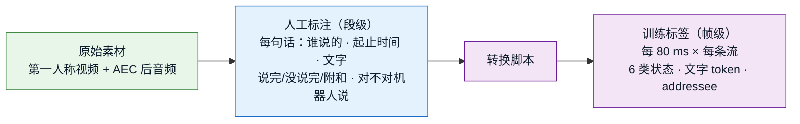

# 数据集：格式与获取方法（讨论稿）

> **本文件 = 数据集格式与获取方法的讨论场所**，定稿后作为 C1 数据集（AVSC-Corpus）的权威文档。
> 模型要吃什么、吐什么以 [`architecture.md`](architecture.md) 为准；本文件只回答**数据长什么样、从哪来、怎么标**。
>
> 标记：✅ 已定 ｜ 💡 建议待拍板 ｜ ⏳ 待讨论
>
> **最后更新**：2026-09-25（初稿；状态改为按词标注，沿用 X2-Turn 流程）

---

## 0. 已定前提（来自 architecture.md，数据必须与之一致）✅

| 项 | 前提 |
|---|---|
| 视角 | **机器人第一人称**，单目 RGB，摄像头装在机器人头部 |
| 音频 | 单通道 16 kHz，**已做回声消除（AEC），不含机器人自己的 TTS** |
| 人脸 | 由前置视觉系统给出，**稳定、完整可见**，每张脸带 `person_id` |
| 模型输出 | 每 80 ms × 每条流（K 张脸 ＋ 1 条 `others`）：6 类说话状态 · ASR 文字 · addressee |
| 语言 | 骨干 X2-Turn 为中英双语 |
| 资源 | 人力、物力、算力充足，**数据量不是问题**；只讨论数据该怎么设计 |

---

## 1. 一条样本长什么样（格式）💡

### 1.1 核心思路：**人标"段"，脚本转"帧"**

模型训练要的是"每 80 ms × 每条流"的逐帧标签，但**人不可能逐 80 ms 去标**。所以分两层：



好处：
- 标注员面对的是"一句话"，好理解、好校对；
- 帧级标签由脚本按固定规则生成，**换分词器、改延迟、改状态定义时不用重标**，重跑脚本即可。

### 1.2 目录结构（草案）

```
clip_000123/
  video.mp4          # 原始第一人称视频
  audio.wav          # 16 kHz 单声道，已 AEC
  faces.jsonl        # 前置视觉系统的输出：每帧每张脸的 person_id / 框 / 头姿视线
  utterances.jsonl   # ★ 人工标注（段级），见 1.3
  meta.json          # 片段级信息，见 1.4
```

⏳ 人脸 crop 是存下来，还是训练时由 `faces.jsonl` 现裁 —— 待定。

### 1.3 段级标注：`utterances.jsonl`（每句话一行）

```json
{"utt_id": "u_0007", "speaker": "p_0042", "start": 12.36, "end": 14.10,
 "text": "有没有低糖的酸奶",
 "words": [{"w": "有",   "s": 12.36, "e": 12.52, "state": "noidle"},
           {"w": "没有", "s": 12.52, "e": 12.80, "state": "speaking"},
           {"w": "低糖的","s": 13.20, "e": 13.62, "state": "speaking"},
           {"w": "酸奶", "s": 13.62, "e": 14.10, "state": "turn_end"}],
 "to_robot": 1}
```

| 字段 | 含义 | 取值 |
|---|---|---|
| `speaker` | 谁说的 | 某个 `person_id`，或 `others`（画外的人） |
| `start` / `end` | 起止时间（秒） | |
| `text` / `words` | 文字，及词级时间戳 | 词级时间戳可由强制对齐自动生成 |
| `words[].state` | ★ **每个词的状态**（X2-Turn 定义，architecture §2.1） | `noidle`（开头还没语义的音节）/ `speaking`（有部分语义、未完整）/ `turn_end`（说到这个词语义完整了）/ `backchannel`（附和、填充词） |
| `to_robot` | **这句话是不是希望机器人回应**（architecture §2.4） | `1` 是 / `0` 不是 / `null` 拿不准（不算损失）。附和句一律 `null` |

### 1.4 片段级信息：`meta.json`

`场景` · `人数` · `是否含画外说话人` · `重叠比例` · `语言` · `录制设备` · `授权与使用范围`。

### 1.5 段 → 帧的转换规则 ⏳

这是格式里最关键、也最需要讨论的部分：

| 帧级标签 | 由段级标注怎么生成（草案） |
|---|---|
| 6 类状态 | **按词复制**（沿用 X2-Turn）：每个词的 `state` 复制到它占据的每一帧；**没有词覆盖的帧一律 `idle`**（包括开口前、词间停顿、说到一半的停顿、说完后）。`uncertain` 不标 |
| 文字 token | 按词级时间戳，把每个 token 放到对应的 80 ms 帧上；没字的帧填 PAD |
| addressee | 这句话的 `to_robot` 复制到它占据的所有帧；其余帧（静音、附和、`null`）不算损失 |
| `others` 流 | `speaker = others` 的句子按同样规则生成；没有画外声时全 `idle` + 全 PAD |

**逐词状态怎么来**：沿用 X2-Turn 的流程 —— 强制对齐得词级时间戳 → LLM 给每个词标状态 → 人工抽检校对（§4）。
帧位置按 X2-Turn 的规则计算（以词的起点为锚，再加上骨干的延迟偏移），由脚本统一实现。

⏳ 待定：
- 被别人打断、没说完就停了：最后一个词标 `speaking`（从未达到完整）是否就够；
- 别人附和时，正在说话的人这边不受影响（仍按他自己的词标）——需确认；
- 多人重叠时 LLM 逐词标注是否可靠（它看的是这个人自己的转写，应当不受影响，但需抽检）。

---

## 2. 数据要覆盖哪些情况 💡

### 2.1 模型层面（对应 architecture §3 运行情形）

| 情形 | 为什么必须有 |
|---|---|
| 画面没人，画外有人说 | 训练 `others` 流 |
| 画面一人，他在说 | 基础情形 |
| **画面一人沉默，画外有人说** | ★ 检验视觉条件是否真的生效（不能把听到的话都记到眼前这个人身上） |
| 多人，一人说 | 归属 |
| **多人重叠说** | ★ C2 的判据 |
| 多人都沉默，画外有人说 | 画外语音不能凭空消失 |

### 2.2 业务层面（导购场景）

- 单个顾客问询；
- **结伴**：同伴之间闲聊、中途转头问机器人（addressee 的关键样本）；
- **附和**："嗯嗯""对"；
- **说到一半停顿**："我想找一款……"（语义完整性的关键样本）；
- 互相打断、抢话；
- 画外有人叫、背景人声、门店噪声；
- 中文与英文（比例待定）。

---

## 3. 获取方法 💡

| 方式 | 做法 | 优点 | 缺点 | 定位 |
|---|---|---|---|---|
| **A. 自采录制** | 在模拟门店 / 真实门店，用机器人头部摄像头 + 麦克风录制；演员按脚本或半脚本互动 | 视角、场景、标签定义完全可控；可以刻意设计 2.1 的各种情形 | 成本高；演出感可能不自然 | ★ **主力**，也是 C1 数据集本体 |
| **B. 合成混音** | 取单人说话的 AV 素材，叠加其他人声 / 画外声 / 噪声 | 规模大；有干净的单人源，标签精确；画外情形易构造 | 声学与真实场景有差距；**视线 / addressee 无法合成** | 补规模，主要服务分离与状态 |
| **C. 公开数据复用** | 见下表 | 现成 | 视角、语言、标签都对不上，需要重标或只能部分使用 | 预训练 / 外部对照 / 探针 |
| **D. 自动预标 + 人工校对** | 用 X2-Turn / ASR / 强制对齐先出初稿，人工只校正 | 大幅降低标注成本 | 初稿偏差可能被继承 | 配合 A / C 的标注流程 |

**公开数据（目前掌握的信息）**：

| 数据 | 已知情况 | 能用来做什么 |
|---|---|---|
| AMI | 会议，第三人称房间机位；已有 4 场用于探针 | 早期探针与注入深度实验起步；给不了 addressee |
| MISP-Meeting | 会议，125 h，重叠率约 57%，带视频；8 麦阵 + 全景相机 | 多人重叠的补充与外部对照 |
| MM-F2F | 英文在线视频，210 h；只发标注和视频链接、不发媒体；标注是听者行为而非语义完整性 | 可能用于预训练，需重标 |
| AVCocktail | 多人（最多 8 人）视听对话，代码公开 | 待评估 |
| Ego4D "Talking to Me" | 第一人称、逐人判断"是否在对摄像头佩戴者说话"；以意图为准，按段标再展开成逐帧 | 可借用其定义思路；也可做 addressee 的预训练 / 外部对照 |

---

## 4. 标注流程（草案）⏳

1. **自动预处理**：前置视觉系统出人脸轨迹与 `person_id`；ASR + 强制对齐出文字与词级时间戳。
2. **人工第一轮**：确认每句话**是谁说的**（画面里哪张脸，还是画外）、修正文字。
3. **LLM 逐词预标状态**（X2-Turn 流程），**人工第二轮**校对逐词状态，并标每句的 `to_robot`（标注员只看到这句话结束为止的内容）。
4. **一致性抽检**：多人重复标一部分，算一致性；定义不清的地方回头修标注规范。
5. **脚本转帧**：按 1.5 的规则生成训练标签。

---

## 5. 待讨论 ⏳

1. 逐词状态的标注规范（1.5）：被打断句子的标法、多人重叠时 LLM 预标的可靠性；是否剔除 `uncertain`。
2. ~~addressee 的定义与标注粒度~~ → ✅ "是否希望机器人回应"，按句标（architecture §2.4）。
3. 自采录制的设计：场地、脚本 vs 半脚本 vs 自由互动、每段人数与重叠比例、中英比例。
4. 合成混音的配方：用哪些单人 AV 素材、怎么叠加、画外声怎么构造。
5. 公开数据的具体用法与许可核查。
6. 人脸 crop 是否落盘；隐私、授权与再分发范围（人脸与声音都属于敏感个人信息）。
7. 训练 / 验证 / 测试的切分原则（按人、按场景切，避免同一个人同时出现在训练和测试里）。
