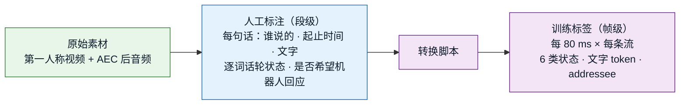
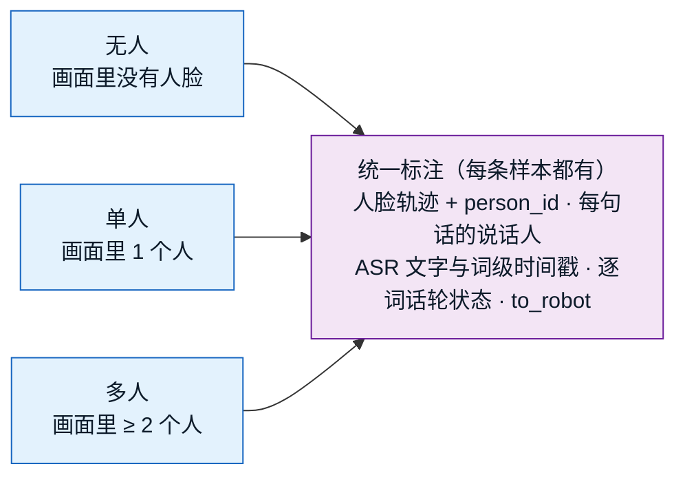
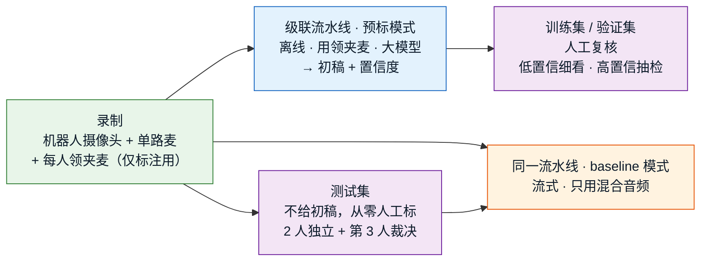

# 数据集：格式与获取方法（讨论稿）

> **本文件 = 数据集格式与获取方法的讨论场所**，定稿后作为 C1 数据集（AVSC-Corpus）的权威文档。
> 模型要吃什么、吐什么以 [`architecture.md`](architecture.md) 为准；本文件只回答**数据长什么样、从哪来、怎么标**。
>
> 标记：✅ 已定 ｜ 💡 建议待拍板 ｜ ⏳ 待讨论
>
> **最后更新**：2026-09-28（定规模 400 h、中英各半；按"无人 / 单人 / 多人"三类组织采集；定标注流程：级联预标 + 人工复核、每人配领夹麦、测试集从零标）

---

## 0. 已定前提（来自 architecture.md，数据必须与之一致）✅

| 项 | 前提 |
|---|---|
| 视角 | **机器人第一人称**，单目 RGB，摄像头装在机器人头部 |
| 音频 | 单通道 16 kHz，**已做回声消除（AEC），不含机器人自己的 TTS** |
| 人脸 | 由前置视觉系统给出，**稳定、完整可见**，每张脸带 `person_id` |
| 模型输出 | 每 80 ms × 每条流（K 张脸 ＋ 1 条 `others`）：6 类说话状态 · ASR 文字 · addressee |
| 语言 | 骨干 X2-Turn 为中英双语 |
| 资源 | 人力、物力、算力充足，**数据量不是问题**；只讨论数据该怎么设计 |
| **规模** | **约 400 小时**（2026-09-28 定）；按每场约 10 分钟计 ≈ 2400 场 |
| **语言** | **中文、英文各 50%**，各约 200 小时（2026-09-28 定） |

---

## 1. 一条样本长什么样（格式）💡

### 1.1 核心思路：**人标"段"，脚本转"帧"**

模型训练要的是"每 80 ms × 每条流"的逐帧标签，但**人不可能逐 80 ms 去标**。所以分两层：



好处：
- 标注员面对的是"一句话"，好理解、好校对；
- 帧级标签由脚本按固定规则生成，**换分词器、改延迟、改状态定义时不用重标**，重跑脚本即可。

### 1.2 目录结构（草案）

```
clip_000123/
  video.mp4          # 原始第一人称视频
  audio.wav          # 16 kHz 单声道，已 AEC
  faces.jsonl        # 前置视觉系统的输出：每帧每张脸的 person_id / 框 / 头姿视线
  utterances.jsonl   # ★ 人工标注（段级），见 1.3
  meta.json          # 片段级信息，见 1.4
```

⏳ 人脸 crop 是存下来，还是训练时由 `faces.jsonl` 现裁 —— 待定。

### 1.3 段级标注：`utterances.jsonl`（每句话一行）

```json
{"utt_id": "u_0007", "speaker": "p_0042", "start": 12.36, "end": 14.10,
 "text": "有没有低糖的酸奶",
 "words": [{"w": "有",   "s": 12.36, "e": 12.52, "state": "noidle"},
           {"w": "没有", "s": 12.52, "e": 12.80, "state": "speaking"},
           {"w": "低糖的","s": 13.20, "e": 13.62, "state": "speaking"},
           {"w": "酸奶", "s": 13.62, "e": 14.10, "state": "turn_end"}],
 "to_robot": 1}
```

| 字段 | 含义 | 取值 |
|---|---|---|
| `speaker` | 谁说的 | 某个 `person_id`，或 `others`（画外的人） |
| `start` / `end` | 起止时间（秒） | |
| `text` / `words` | 文字，及词级时间戳 | 词级时间戳可由强制对齐自动生成 |
| `words[].state` | ★ **每个词的状态**（X2-Turn 定义，architecture §2.1） | `noidle`（开头还没语义的音节）/ `speaking`（有部分语义、未完整）/ `turn_end`（说到这个词语义完整了）/ `backchannel`（附和、填充词） |
| `to_robot` | **这句话是不是希望机器人回应**（architecture §2.4） | `1` 是 / `0` 不是 / `null` 拿不准（不算损失）。附和句一律 `null` |

### 1.4 片段级信息：`meta.json`

`类别`（无人 / 单人 / 多人，§2）· `场景` · `人数` · `是否含画外说话人` · `重叠比例` · `语言` · `录制设备` · `授权与使用范围`。

### 1.5 段 → 帧的转换规则 ⏳

这是格式里最关键、也最需要讨论的部分：

| 帧级标签 | 由段级标注怎么生成（草案） |
|---|---|
| 6 类状态 | **按词复制**（沿用 X2-Turn）：每个词的 `state` 复制到它占据的每一帧；**没有词覆盖的帧一律 `idle`**（包括开口前、词间停顿、说到一半的停顿、说完后）。`uncertain` 不标 |
| 文字 token | 按词级时间戳，把每个 token 放到对应的 80 ms 帧上；没字的帧填 PAD |
| addressee | 这句话的 `to_robot` 复制到它占据的所有帧；其余帧（静音、附和、`null`）不算损失 |
| `others` 流 | `speaker = others` 的句子按同样规则生成；没有画外声时全 `idle` + 全 PAD |

**逐词状态怎么来**：在 X2-Turn 流程（强制对齐 → LLM 逐词标状态）基础上，改为**两个 LLM 交叉预标 + 人工全量核验**（§4）。
帧位置按 X2-Turn 的规则计算（以词的起点为锚，再加上骨干的延迟偏移），由脚本统一实现。

⏳ 待定：
- 被别人打断、没说完就停了：最后一个词标 `speaking`（从未达到完整）是否就够；
- 别人附和时，正在说话的人这边不受影响（仍按他自己的词标）——需确认；
- 多人重叠时 LLM 逐词标注是否可靠（它看的是这个人自己的转写，应当不受影响，但需抽检）。

---

## 2. 数据集怎么组织：按采集方式分三类 ✅（2026-09-28 定）

### 2.1 原则：**类别只管"怎么采"，标注对所有样本都一样**

- **分类依据 = 采集时画面里有几个人**，因为这决定了怎么组织录制（要约几个人、怎么布置）。
- **标注不参与分类**：逐词话轮状态、ASR、`to_robot`、说话人归属，**每一条样本都要标全**，与它属于哪一类无关。
- "说到一半停顿""附和""同伴闲聊""画外有人说"这些**不是类别**，而是写进每一类**录制脚本**里、要求出现的内容（§2.3）。



### 2.2 三类的定义与采集方式

| 类别 | 画面 | 声音来源 | 怎么采（建议） | 训练什么 |
|---|---|---|---|---|
| **无人** | 没有人脸（`K = 0`） | 画外有人说 / 门店噪声与广播 / 安静 | 镜头对着空货架或空通道，工作人员在画外说话、走动 | `others` 流；噪声与广播不能进 `others` |
| **单人** | 1 个人（`K = 1`） | 他本人，和 / 或画外的人 | 1 位顾客与机器人按购物任务交互；中途安排画外有人说话 | 单人的话轮与完整性；**他沉默时画外有人说**（检验视觉条件是否生效） |
| **多人** | ≥ 2 个人（`K ≥ 2`） | 画面里的人，和 / 或画外的人 | 2–4 人结伴，按购物任务交互 | 归属、重叠、同伴闲聊与转头问机器人、附和 |

- 类别按**录制设置**记录在 `meta.json` 的 `类别` 字段。片段中途有人走进走出也没关系：**逐帧的实际人数**由 `faces.jsonl` 给出，训练和评测以它为准。
- 💡 三类的时长比例（建议）：**无人 10% · 单人 35% · 多人 55%**。多人是核心，给最大份额；无人最容易采，少量即可。⏳ 待拍板。

### 2.3 每一类的录制脚本里要求出现的内容 💡

录制用**半脚本**：给参与者一个购物任务（如"帮朋友挑一款低糖零食"），不给台词；由现场导演按下表提示，保证覆盖。

| 要求出现的内容 | 无人 | 单人 | 多人 |
|---|---|---|---|
| 画外有人说话 | ✓（主体） | ✓ | ✓ |
| 门店噪声、背景音乐、广播 | ✓ | ✓ | ✓ |
| 对机器人提问、说完一句 | | ✓ | ✓ |
| **说到一半停顿**（"我想找一款……"） | | ✓ | ✓ |
| **附和**（"嗯嗯""对"） | | ✓（对机器人） | ✓（对同伴 / 对机器人） |
| 看着商品问机器人 | | ✓ | ✓ |
| 自言自语、打电话（不对机器人说） | | ✓ | ✓ |
| **嘴在动但没说话**（吃东西、嚼口香糖） | | ✓ | ✓ |
| **同伴之间闲聊** | | | ✓ |
| **闲聊中转头问机器人** | | | ✓ |
| **两人同时说**（重叠）、互相打断 | | | ✓ |

⏳ 每项的最低出现比例待定（例如重叠时长占多人类的 ≥ 15%）。

### 2.4 训练 / 验证 / 测试怎么切 💡

- **按人、按场地、按场次切**：同一个人、同一场交互只能出现在一个集合里；三类各自按同样规则切，保证每个集合里三类都有。
- 额外留一个**没见过的场地**作为泛化测试。
- 规模建议：测试约 20–30 小时，验证约 10–20 小时，其余训练。

### 2.5 评测时的细分：从标注里**自动**推出情形标签 💡

不需要人工标"情形"。脚本从每条样本的统一标注里，逐时刻推出：
这一刻几个人在说、画外有没有人说、是否重叠、这句 `to_robot` 是多少、是不是附和。
测试集的所有指标按这些情形**分档报告**（对应 architecture §3 运行情形，也是 C3 benchmark 的难度分档）。

---

## 3. 获取方法 💡

| 方式 | 做法 | 优点 | 缺点 | 定位 |
|---|---|---|---|---|
| **A. 自采录制** | 在模拟门店 / 真实门店，用机器人头部摄像头 + 麦克风录制；按 §2 的三类、半脚本互动 | 视角、场景、标签定义完全可控；可以按 §2.3 刻意安排各种情况 | 成本高；演出感可能不自然 | ★ **主力**，也是 C1 数据集本体 |
| **B. 合成混音** | 取单人说话的 AV 素材，叠加其他人声 / 画外声 / 噪声 | 规模大；有干净的单人源，标签精确；画外情形易构造 | 声学与真实场景有差距；**视线 / addressee 无法合成** | 补规模，主要服务分离与状态 |
| **C. 公开数据复用** | 见下表 | 现成 | 视角、语言、标签都对不上，需要重标或只能部分使用 | 预训练 / 外部对照 / 探针 |
| **D. 级联预标 + 人工复核** | 级联 baseline 的离线预标模式出初稿（§4），人工只复核 | 大幅降低标注成本；与 C3 baseline 共用代码 | 初稿偏差可能被继承 → 测试集不给预标 | 配合 A 的标注流程 |

**公开数据（目前掌握的信息）**：

| 数据 | 已知情况 | 能用来做什么 |
|---|---|---|
| AMI | 会议，第三人称房间机位；已有 4 场用于探针 | 早期探针与注入深度实验起步；给不了 addressee |
| MISP-Meeting | 会议，125 h，重叠率约 57%，带视频；8 麦阵 + 全景相机 | 多人重叠的补充与外部对照 |
| MM-F2F | 英文在线视频，210 h；只发标注和视频链接、不发媒体；标注是听者行为而非语义完整性 | 可能用于预训练，需重标 |
| AVCocktail | 多人（最多 8 人）视听对话，代码公开 | 待评估 |
| Ego4D "Talking to Me" | 第一人称、逐人判断"是否在对摄像头佩戴者说话"；以意图为准，按段标再展开成逐帧 | 可借用其定义思路；也可做 addressee 的预训练 / 外部对照 |

---

## 4. 标注流程 ✅（2026-09-28 定；依据同类数据集的标注文献）

### 4.1 核心思路：级联 baseline 当预标器，人工只复核

用多个小模型（ASD、ASR、强制对齐、LLM……）级联 / 并联，拼出与我们模型**相同的输入输出**。
这套流水线**同一份代码、两种配置**：离线的"预标模式"给标注出初稿，流式的"baseline 模式"作为 C3 的级联 baseline。



| | 预标模式（标注用） | baseline 模式（C3 评测用） |
|---|---|---|
| 音频 | **每人的领夹麦**（干净单人声） | 单路混合音频（与模型输入一致） |
| 时间方向 | 离线，可以看未来 | 流式、因果 |
| 模型 | 能用多大用多大（Whisper-large / Paraformer、大 LLM） | 满足实时要求的配置 |
| 说话人归属 | 领夹麦能量 + ASD + 声纹聚类，三者交叉核对 | 只用 ASD |

### 4.2 录制时每人配领夹麦（只用于标注）✅

同类可靠的多人数据集（AMI、AISHELL-4、AliMeeting、MISP、NOTSOFAR-1、CHiME-6）都靠**每人一路近讲麦**解决三件事：
转写听得清、说话人归属（哪路有声就是谁）、词级时间戳（在单人干净音频上强制对齐）。
单路混合音频在重叠段几乎无法可靠转写与对齐。领夹麦**不作为模型输入**，只存档供标注使用。

### 4.3 步骤

| 步 | 做什么 | 要点 |
|---|---|---|
| **1. 自动预标** | 预标模式跑全量：人脸轨迹 + `person_id`；每路领夹麦做 ASR + 强制对齐；ASD 预判每句话是哪张脸说的；两个 LLM 交叉预标逐词状态；LLM 结合文字与朝向预标 `to_robot` | 每个标签附**置信度 / 是否有分歧**；ASD、领夹麦能量、声纹三者对不上或找不到脸的，标"疑似画外" |
| **2. 人工第一轮** | **确认 / 修正**说话人归属与转写（不从零开始） | 人脸 ID 核验：每条轨迹只挑一张代表图给人确认（EasyCom 做法，工作量约降到 1/15）；显式标出**重叠段**与听不清处；改完文字后**在人工文本上重做强制对齐**，不沿用 ASR 时间戳 |
| **3. 人工第二轮** | 核验逐词状态；标每句 `to_robot` | 两个 LLM 不一致的词优先细看；`to_robot` 由 **2 人独立标、第 3 人裁决**，标注员只看到这句话结束为止的内容 |
| **4. 一致性与质检** | 先**试标一批 → 修订标注规范** → 再正式标；按语言与人数分层抽 **5–10% 双标** | 另留一小块**不给预标**的子集，量化"预标把标注员带偏了多少" |
| **5. 脚本转帧** | 按 §1.5 生成逐帧标签 | 词时长明显异常（如偏离均值 3σ）的送回复核 |

**测试集例外**：不给初稿，**从零人工标**，2 人独立 + 第 3 人裁决（参照 NOTSOFAR-1）。
否则标注员会被预标带偏，标签偏向级联 baseline 的判断，baseline 在 benchmark 上相当于跟自己的答案对比，分数虚高。

**修改日志**：记录每个标签有没有被人改、原来是什么 → 报告"预标被改掉的比例"与各类混淆。
X2-Turn / Easy Turn / SoulX-Duplug 的话轮标签都是 LLM 直接生成、未报告人工一致性，这一数据本身可作为 C1 的亮点。

### 4.4 一致性目标

| 标签 | 参考 | 目标 |
|---|---|---|
| 说话人归属 | AVA-ActiveSpeaker κ = 0.72 | ≥ 0.7 |
| 逐词状态 / 说完没 | GRASS 0.75；法语电视话轮终结 0.75 | ≥ 0.75 |
| `to_robot` | AMI（M4）addressee 0.70–0.81；AMI 另有报告仅 0.45–0.56 | ≥ 0.7（不宜定太高） |

⚠️ 我们的 `to_robot` 只让标注员看到句末为止，AMI 可看全程，数值不能直接比较，论文里要说明。

### 4.5 工具、人力、隐私

- **工具**：时间轴类用 ELAN / Praat；人脸框修正用 CVAT；"选是哪张脸说的 + 标 `to_robot`"做自研界面，一次只看一句话。
- **人力**：外推估计约 **5000–8000 人时**（非文献数据，试标时实测后再定）。参照：GRASS 从零标约 36–54 倍实时、修正约 18–27 倍实时。
- **隐私与发布**：签书面知情同意，**明确授权公开发布人脸与声音**；录制时提醒不说个人信息；背景里未授权的路人一律打码。
  **不用换脸 / 变声去身份化**（会破坏唇动信息）。发布采用研究许可（参照 EasyCom 的 CC-BY-NC 4.0、Ego4D 的自有许可）。

### 4.6 常见坑

- **短词时间戳不准**：附和词"嗯""对"最受影响，领夹麦能缓解。
- **画外说话人**：Ego4D / AVA 都不给画外的人身份；`others` 需单独规则（如画外说话的人后来入画怎么处理）。⏳ 待定。
- **锚定偏差**：标注员倾向接受看似合理的机器结果 —— 这正是测试集不给预标、以及留"无预标子集"的原因。

**参考来源**：Ego4D（2110.07058）、AVA-ActiveSpeaker（1901.01342）、EasyCom（2107.04174）、MISP 2025（2505.13971）、
AMI、AISHELL-4（2104.03603）、AliMeeting（2110.07393）、NOTSOFAR-1（2401.08887）、CHiME-6（2004.09249）、
Seamless Interaction（2506.22554）、X2-Turn（2608.10878）、Easy Turn（2509.23938）、SoulX-Duplug（2603.14877）、
MM-F2F（2505.12654）、GRASS（2504.09980）、Jovanovic et al. 2006（E06-1022）。

---

## 5. 待讨论 ⏳

1. 逐词状态的标注规范（1.5）：被打断句子的标法、多人重叠时 LLM 预标的可靠性；是否剔除 `uncertain`。
2. ~~addressee 的定义与标注粒度~~ → ✅ "是否希望机器人回应"，按句标（architecture §2.4）。
3. 自采录制的设计：~~规模、中英比例~~（✅ 400 h、中英各半）；~~怎么分类~~（✅ 无人 / 单人 / 多人）；
   待定：三类时长比例（§2.2）、§2.3 各项的最低比例、场地数量、参与者人数。
4. 合成混音的配方：用哪些单人 AV 素材、怎么叠加、画外声怎么构造。
5. 公开数据的具体用法与许可核查。
6. 人脸 crop 是否落盘；隐私、授权与再分发范围（人脸与声音都属于敏感个人信息）。
7. 训练 / 验证 / 测试的切分（§2.4 建议：按人、场地、场次切 + 留一个没见过的场地），待拍板。
