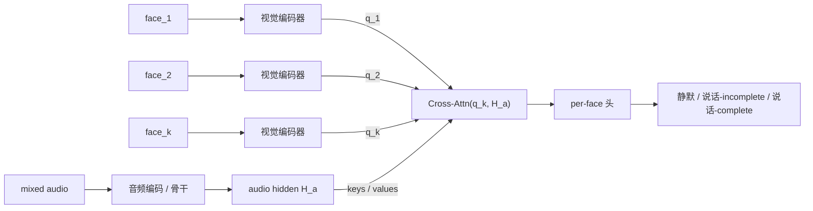

> ⚠️ **本文件是事实记录，不是计划。** 其中的计划、架构、数据源决策**已作废** ——
> 对外定位以 [`../cvpr-framing.md`](../cvpr-framing.md) 为准，模型契约以 [`../architecture.md`](../architecture.md) 为准。
> 保留本文件只为两件事：**探针怎么跑的 / 得到什么数**，以及**文献核查的一手结论**。（2026-09-21 清理）

# Phase 2 执行日志（视觉模态：多人 per-face 语义完整性）

（原对应旧计划 Phase 2 模型结构改造，该计划已删除。）
本文件记录 Phase 2 的**方向转向（re-scope）**、支撑它的**深度文献调研**、以及待决的架构/数据岔路。
执行记录约定见 [`README.md`](README.md)。

> ## 📌 Phase 2 当前结论摘要（TL;DR）
>
> 1. **方向转向（用户拍板 2026-09-17）**：从"单说话人 complete/incomplete"转到
>    **多人入境下、chunk 级、per-face 判「谁在说 + complete/incomplete」**。依据 = Phase 0/1 四个探针
>    连成的因果链：单人干净音频已近天花板（0.99），视觉**不能直接读完整性**（探针B 0.42≈随机）
>    但**能做说话人归属**（sanity 0.649）；音频在竞争说话人下崩塌（0.47）。
>    → 视觉的正确职责 = 把「多人混合」还原成「单人干净」（谁在说），完整性交给音频。
> 2. **放开约束**：**不再守 X2-Turn 冻结范式**，可从头构建+训练模型（有算力/人力），**数据集自建**。
>    起步场景锁 **multi-party（AMI 4 人会议）**；融合方式选 **端到端联合融合**（视听 token → per-face 输出）。
> 3. **★ 新颖性裁决（深度调研 2026-09-17）**：贡献**新颖**，但"新"必须精确钉在
>    **语义完整性 + 真正 per-face 独立输出**，**绝不能**写成"AV 多人话轮预测"（该地已被 MuVAP 占）。
>    未占缺口 = **per-face 语义完整性**（"谁在说 AND 语义闭合没"）作为多脸同框、chunk 级、流式、
>    每脸独立的联合输出 —— **无人做过**。
> 4. **数据集自建被证明必需**：唯一真语义完整性源 GRASS 是纯音频/德语/95min；无任何现成语料能训此任务。
>    → **C1（双轴语义完整性语料）从"数据贡献"坐实成承重贡献。**
> 5. **最高杠杆的下一步**：先挖清 **AV-Dialog**（唯一可能威胁"语义"新颖性、且调研对其判断最不确定的工作）。

状态图例：✅ 完成 ｜ 🔄 进行中 ｜ ⛔ 受阻 ｜ ⏳ 待做

| 任务 | 状态 |
|---|---|
| 方向转向决策（多人 per-face / 联合融合 / AMI / 从头训练） | ✅ 用户拍板 |
| 新颖性深度调研（竞品地图 + 裁决 + 风险） | ✅ 完成 |
| AV-Dialog 全文方法深挖（最高杠杆待办） | ✅ 完成（§2.3）：行为事件token/单目标/dyadic，不威胁 C1 |
| 重叠段完整性"恢复实验"（AMI 单人/重叠分档） | ⏳ 待做 |
| 数据集方案（自建 vs 复用 AVCocktail 加双轴标注） | ⏳ 待定 |
| 架构定稿（v5 最简版） | 🔄 已收敛并写入 architecture.md/HTML；**唯一悬置=forward 输出形态**（§2.4） |

---

## 2.0 — 方向转向：为什么从"单人完整性"走到"多人 per-face"（2026-09-17）

**触发**：Phase 0/1 的探针结论指向——单说话人判 complete/incomplete，**纯音频已足够**。
用户据此提出：视觉的价值应在**多人入境**场景，结合视频+音频流，chunk 级判**是哪个人在说 + complete/incomplete**。

**证据链（把四个探针连起来）**：

| 实验 | 结论 | 含义 |
|---|---|---|
| 探针 A（干净单人） | 音频完整性 AUC **0.99** | 单人干净 → 音频够 |
| 噪声 gate（竞争说话人） | 剔时长后 **0.77→0.47** | 混合/重叠 → 音频**塌** |
| 探针 B（视觉→完整性） | AUC **0.42 ≈随机** | 视觉**不能**直接读完整性 |
| 探针 B（视觉→说话人身份，sanity） | acc **0.649** vs 随机 0.25 | 视觉**能**做说话人归属 |

**锐化后的定位**：视觉的正确职责**不是**"帮判完整性"，而是**把「多人混合」还原成「单人干净」**——
即 chunk 级判定"谁在说"（active-speaker / 归属）；完整性判断继续交给已近天花板的音频，
只作用在被归属出来的那一路上。**每个模态只做被实测证明擅长的事。**
这也解释了文献那条一直被小心区分的证据：AV 视觉"+13%""52%→72%"全是 **VAD/话轮边界（唇动≈语音活动）= 归属轴**，
不是语义完整性轴（见 [`phase1.md`](phase1.md) 探针 B 的"关键区分"）。

**用户拍板的两个岔路**（2026-09-17，AskUserQuestion）：
- 视觉角色 → **端到端联合融合**：视听 token → per-face `(active, complete)`。
- 起步场景 → **直接 multi-party（AMI 4 人会议）**。
- 追加放开：**不再守 X2-Turn 冻结范式**，可从头构建+训练模型；**数据集自建**（有算力/人力）。

**顺带解锁**：AMI 本机可跑（探针 B 就在 ES2002 上跑过 FaceLandmarker），
等于绕开了 Phase 1 MM-F2F 媒体锁在 YouTube/GDrive 的取数拦路石（见 [`phase1.md`](phase1.md)）。
AMI 每参会者有**个人特写摄像头**（非仅 352×288 房间全景）→ 对 ASD 分辨率有利，**须先确认能否拿到特写机位**。

---

## 2.1 — ★ 新颖性深度调研（2026-09-17）

**方法**：deep-research 骨架（多角度检索 → 抓取一手 → 3 票对抗核查 → 综合）。
规模：99 个 agent、16 篇一手来源、75 条断言 → 核查 top 25 → **24 confirmed / 1 refuted / 0 unverified**。
运行溯源：workflow `wf_80a005aa-f7a`。

### 裁决

**贡献新颖，但"新"必须精确落在「语义完整性 + 真正 per-face 独立输出」上，不能落在"AV 多人话轮"本身。**
2026 年该空间突然变拥挤（MuVAP 6 月、MM-VAP 7 月、AVCocktail 9 月），
但**所有 AV/多人话轮工作都挤在行为/VAD 轴（VAP：预测未来语音活动）**，**无人做语义完整性**，
更无人做 **per-face 的语义完整性**。项目从 Phase 0 咬住的"语义完整性 vs 行为结果"区分（§0.1.1）正是护城河。

### 竞品地图（按覆盖的轴分类，均一手核查）

| 工作 | AV? | 多人? | per-face 独立输出? | 预测目标 | 语义完整性? |
|---|---|---|---|---|---|
| **MuVAP** (arXiv:2606.16731, Qi&Skantze, 2026.6) ★最近 | ✅ 单麦+单摄 | ✅ | ❌ 塌成"当前vs下一 floor-holder"2态 | Shift-Hold / next-speaker | ❌ 全文 completeness=0 / EOU=0 |
| **MM-VAP** (arXiv:2607.07294, 2026.7) | ✅ | ❌ 硬编码2人(256态) | ❌ | 未来语音活动 | ❌（"semantic consistency loss"仅为正则项） |
| 多模态编码器 VAP (arXiv:2506.03980) | ✅ | ❌ dyadic(NoXi法语) | ❌ 2×4 bins | VAP | ❌ |
| **Triadic-VAP** (arXiv:2507.07518) | ❌ 纯音频 | ✅ 3人(首个扩VAP到triadic) | ✅ per-speaker VAD | 未来语音活动 | ❌ |
| Seamless VAP (arXiv:2609.14666) | ✅ | ❌ dyadic(Meta Seamless) | ❌ | VAP | ❌ |
| **AVCocktail 测试床** (arXiv:2609.17056, SLT2026) | ✅ | ✅ 最多8人/4并行对话 | ❌ 吃预切好的脸 | VAP shift/hold | ❌ 明确"无外部语义模块" |
| **AV-Dialog** (arXiv:2511.11124) ⚠️最危险 | ✅ | ❌ 只锁**单个**目标说话人 | ❌ | "语义grounded话轮边界" | ⚠️ 摘要层定义不清 |
| **GRASS** (arXiv:2504.09980) | ❌ 纯音频 | — | — | **PCOMP = 真语义完整性(TRP)** | ✅ 但德语/95min/无视频 |
| Moshi (arXiv:2410.00037) | ❌ | ❌ 2流(model+user) | — | 全双工语音 | ❌ |
| Skantze&Irfan (arXiv:2501.08946) | ❌ 音频/文本 | HRI | — | TurnGPT+VAP 上机器人 | 部分(TurnGPT文本端点) |
| Abbo et al. (arXiv:2503.15496) | ✅ | ✅ HRI | 经典DoA+分离+人脸识别，非学习式ASD | 谁在说 | ❌ |

### 精确的未占缺口

> **per-face 语义完整性** —— "谁在说 **且** 他这句话语义闭合了没"，作为多张脸同框下、chunk 级、
> 流式、**每张脸独立**联合预测的输出。**无任何现有模型做此。**

三条轴的交集全空：① 语义完整性（只有 GRASS，纯音频/德语/95min）；② 真正 per-face 独立输出
（MuVAP 都塌成 2 态 floor-holder）；③ 二者合一 + 多人 + AV。

### 3 个最危险竞品 + 差异化打法

1. **MuVAP（最像）**：同为 AV+多人+HRI+单传感器。差异化钉死两点：
   (a) 它只预测**行为 Shift-Hold**，我们预测**语义完整性**（正交轴，探针数据可佐证行为≠语义）；
   (b) 它把 N 人塌成"当前vs下一"2 态，我们是**每张脸独立**三态输出。
   **绝不能**把卖点写成"AV 多人话轮预测"——那句话 MuVAP 已占。
2. **AV-Dialog（最危险审稿风险）**：自称"语义grounded话轮边界"+AV+流式，但**只锁单个目标说话人**、
   非 per-face 多人。差异化：**single-target vs per-face** + **"语义grounded 的 VAD" vs "per-speaker 语义完整性判决"**。
3. **AVCocktail 测试床**：AV 多人话轮测试床已存在（代码公开 github.com/lggvu/mm-turn-taking，最多 8 人）。
   → **可能可复用/扩展它做评测集**（省全自建）；它无 ASD 任务、无完整性标注，正是我们要补的。

### 审稿人会说"这已做过"的点（预先防）

- "MuVAP 已做 AV 多人 HRI 话轮" → 行为轴 vs 语义轴 + 塌态 vs per-face。
- "AV-Dialog 已做语义grounded端点" → single-target vs 多人 per-face（**前提：先确认其内部实现**）。
- "加视觉 clean 无增益"（AV-Dialog/MM-F2F 自证）→ 探针 B 已诚实预判，定位噪声/多人鲁棒 + 语义轴。

### 诚实 caveats（来自调研自身）

1. **未来日期 arXiv ID**：MuVAP(2606)、MM-VAP(2607)、AVCocktail(2609)、Seamless VAP(2609) 的 ID
   晚于常规知识截止；核查者已用 arXiv API + PDF 抽取确认（非仅 WebFetch 回显），与当前日期 2026-09-17 一致，
   但**引用前应再核 ID 与 venue**。
2. **MuVAP 太近**：novelty 必须钉在语义完整性 + per-face；"AV 多人话轮"单独作卖点**不可辩护**。
3. **AV-Dialog "semantically grounded" 摘要层未定义**（PDF 超长未读全）——可能只是"grounded in ASR semantics"，
   也可能真有完整性分类器。**这是全调研不确定性最高点**，动架构前必须挖清。
4. **ASD 侧断言未独立核查**："TalkNet/Light-ASD/LoCoNet/SPELL 不做话轮/完整性"是问题里给定、
   本批未单独验证 → 视为"断言未证"。
5. 部分核查因 WebSearch 不可用而只依赖一手源（仍够，因断言复述论文自身描述）。
6. Triadic-VAP "首个扩 VAP 到 triadic" 为 2-1 非全票。

### 一手来源（16 篇）

arXiv: 2606.16731(MuVAP) · 2607.07294(MM-VAP) · 2506.03980(多模态编码器VAP) · 2507.07518(Triadic-VAP)
· 2609.14666(Seamless VAP) · 2609.17056(AVCocktail) · 2511.11124(AV-Dialog) · 2504.09980(GRASS)
· 2410.00037(Moshi) · 2503.20215(Qwen2.5-Omni) · 2505.12654(MM-F2F) · 2501.08946(Skantze&Irfan HRI)
· 2503.15496(Abbo et al. HRI) ；isca-archive Interspeech-2023 索引；HF openbmb/MiniCPM-o-2_6。

---

## 2.2 — 联合融合在多人下的架构草图（待定稿）

用户选了**端到端联合融合**。放开冻结范式后，per-face 输出的自然形态：

- 每张脸的视觉序列当 **query** attend 音频（视觉干它擅长的"归属"）；per-face **三态**（active 与 completeness 天然耦合）。
- 与 MuVAP 的**结构性差异**：MuVAP 为套 VAP 框架把 N 人塌成 2 态；我们不套 VAP → 可设计**真正 per-face 的多流**输出。

### ★ 必须先堵的张力（比之前的 gate 更尖锐）

探针 A 的 0.99 是**单人**下测的。多人**重叠说话**时，即便归属判对，目标那一路音频仍被叠加污染，
完整性可能照样掉。若共享一次**混合音频前向**得到的 `H_a` 已是退化到 0.47 的东西，
交叉注意力能**路由/归属**（视觉强项），但能否**把声学上被叠掉的完整性线索捞回来**存疑——
若信息已被声学破坏，注意力无中生有不出来。

**最便宜的决定性实验（动大代码前先做）**：AMI 分**单人活跃 / 重叠活跃**两档 →
① 单人活跃档验证"视觉归属+共享 hidden"的 per-face completeness 能否接近探针 A 上界；
② 重叠活跃档验证共享 hidden 上加视觉交叉注意力**能恢复多少**。
这个数字直接定架构：纯 joint-fusion 够，还是必须上**视觉引导分离/波束**（混合体，能救重叠但更重）。

**暂定默认**：纯共享前向 + **重叠段输出 uncertain 起步**，把"视觉引导分离"作为
**仅当恢复实验证明重叠段捞不回时才启用**的升级项（与"必要性验完再上充分性、不预设"的纪律一致）。

---

## 2.3 — ★ AV-Dialog 全文深挖（2026-09-17）：C1 最大风险已拆除

**触发**：调研把 AV-Dialog（arXiv:2511.11124）列为"首个语义完整性视频基准"这一 C1 声明的最大风险
（其"semantically grounded turn-boundary detection"摘要层定义不清）。全文 HTML 三组针对性抽取核实。

**AV-Dialog 到底是什么**：

| 维度 | 实际做的（全文核实） |
|---|---|
| "turn-boundary detection" | **事件 token 预测** `<SOT>`/`<SOB>`/`<EMP>`；采用 PairwiseTurnGPT(Leishman 2024) 的**行为**分类：Normal turn / Overlapping turn / Backchannel |
| "**semantically grounded**"真实含义 | 仅指预测**以转写内容+AV上下文为条件**（grounded in semantics as *context*），**非**完整性分类器 |
| complete/incomplete | **完全没有**——"completeness/incomplete/end-of-utterance"作标注均不出现；"complete"仅指"user's complete intent" |
| 说话人设定 | **单目标说话人**：追踪 ONE target user，干扰人当**噪声抑制**；无 ASD、无 per-face 输出 |
| 视觉用法 | **唇动**（dlib + AV-HuBERT，第一人称单人视频）做噪声下目标语音识别，非注视/多脸 ASD |
| 数据 | **dyadic**（Fisher 纯音频 + InterAct/Seamless 双人 AV）；多说话人为**合成混入 1–4 干扰人**，非原生多人标注 |
| "first"声明 | "first AV dialog framework to **track the target speaker**"、"first streaming AV dialogue system"——锚在对话系统+目标说话人追踪 |

**对三点贡献的影响**：
- **C1（首个多人 per-face 语义完整性视频基准）：安全。** 两条差异轴（语义 vs 行为、per-face vs single-target）均干净成立。
- **C2（方法）：一处措辞收紧。** 不能写"首个 AV 流式话轮模型"（AV-Dialog 已占"首个 AV 流式全双工对话系统"）；
  方法 first 限定在 **per-face + 语义完整性**。
- **C3：多了个强 baseline** —— AV-Dialog 是"行为轴 SOT/SOB"代表，用来演示旧 SOTA 在语义完整性上不 work。

**必写进 Related Work（预防"semantically grounded"混淆）**：
> AV-Dialog [2511.11124] 的"semantically grounded turn-boundary detection"，其"grounded"指预测**以转写语义为条件**，
> 输出为**行为事件 token（`<SOT>`/`<SOB>`）**，沿用 PairwiseTurnGPT 行为分类；追踪**单个**目标说话人、
> 干扰者作噪声抑制，无多脸 ASD、无 per-face 输出。我们的任务正交：对**每张脸独立**判**语义完整性**。

**残余风险（诚实）**：
1. **"semantically grounded"一词已被占用** → 不点名澄清，审稿人极可能误判撞车。上面那段是 must-have。
2. AV-Dialog 的**合成多说话人干扰**（mix 1–4 人）会被说成"已处理多说话人"。答：它**抑制干扰只恢复一路**，
   我们**归属并对每路判完整性** —— 不同问题。
3. Seamless Interaction/InterAct 确认为 **dyadic**，非多人源（若曾作备选数据源须注意）。

**净结论**：C1 的"首个"站得住，前提 = 严格限定在"语义完整性 × per-face × 多人视频"的交集，
并在 Related Work 显式拆解 AV-Dialog。竞品调研的最后一个高不确定点落定。

---

## 2.4 — 架构讨论进度（2026-09-18，暂告段落）

与用户逐步讨论收敛出 **v5 最简架构**，（v5 已被 [`../architecture.md`](../architecture.md) 的 v6 取代，下列为历史记录）：
- **端到端、Route A**（热启动 Voxtral/X2-Turn，非从零）；参考 X2-Turn 的端到端做法（共享 hidden 上多判别头）。
- **输入锁定**：多人**混合音频** + 单目 **RGB**（假设人一定在画面内；不用麦阵/DoA/朝向）。
- **简化（用户拍板）**：视觉只用**一个 RGB 编码器**（内部人脸检测→每人 token），**删去** 几何/唇双分支、addressee、身份 enroll、DoA、body-pose、4 态、L0 闸。
- **结构**：音频→骨干→`H[t]`；RGB→视觉编码器→每人 token 作 Q → **per-face cross-attn 读出**（变长 K、每人独立）。
- **模型层 vs 系统层（用户强调）**：模型 forward **只吐 logits**；"logits→转写/完整性"另作系统层解码。HTML 三张图的模型部分都止于 forward 的 logits。
- **logit 语义**：训练用标签把词表槽位"指派"成 complete/incomplete；完整性信息本在 hidden（探针 A 0.99）。

**★ 唯一悬置的架构决策（下次继续）= 我们 forward 的输出形态**（architecture.md §5）：
① 粒度：K 套 per-face（各自 ASR+状态） vs 单流 ASR + 指派头；
② 状态读出：判别式(读保留槽,仿 X2-Turn) vs 生成式(状态 token,仿 SoulX)。
暂定倾向判别式；粒度待定。定稿后回填 architecture.md §5 + §2 forward 框 + HTML 主图终点。

---

## 待办

- ✅ **AV-Dialog 全文方法深挖**（§2.3）：行为事件 token（SOT/SOB）/单目标/dyadic，不威胁 C1；
  "semantically grounded" = 以语义为条件而非完整性分类 → Related Work 须显式拆解。
- ⏳ **重叠段完整性恢复实验**（§2.2）：AMI 单人/重叠分档，跑归属后 per-face completeness AUC。
- ⏳ **数据集方案**：自建 AV 多人 per-face 双轴（active-speaker × 语义完整性）语料 vs 复用/扩展 AVCocktail
  加双轴标注做评测集。GRASS 证明完整性标注仅存于纯音频/德语/95min → 自建训练集大概率必需。
- ⏳ **AMI 特写机位可得性**确认（决定 ASD 分辨率）。
- ⏳ 架构定稿：per-face 三态头 / 多流 / 重叠段策略；（措辞与竞品表已迁入 `../cvpr-framing.md`）
  （补 MuVAP / MM-VAP / AV-Dialog / AVCocktail / GRASS）。
- ⏳ 复核开放问题：是否有 2024-2026 ASD 论文已从 ASD 侧输出 per-face "is-speaking + is-done"（本批未独立验证）。
