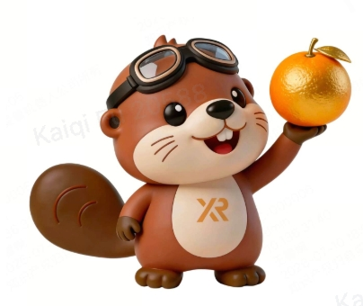

<div align="center">
  <h1>
    
    X2-Turn
  </h1>
  <p>
    <strong>Frame-synchronous streaming ASR and turn-state prediction</strong>
  </p>
  <p>
    <a href="https://huggingface.co/x-square-robot/X2-Turn-4B-0812"></a>
    <a href="https://arxiv.org/abs/2608.10878"></a>
    
    <a href="LICENSE"></a>
  </p>
</div>

[English](README.md) | [Chinese](README_zh.md)

## Overview

X2 Turn transcribes speech and, every 80 ms, predicts a turn-taking state:
`idle`, `noidle`, `speaking`, `turn_end`, `backchannel`, or `uncertain`.

The fastest way to try it is the browser **Turn Demo**. That path needs a GPU
and the 4B weights. It does **not** need an LLM, TTS, or vLLM.

https://github.com/user-attachments/assets/4040eb7a-4f5b-4e25-8ff4-893caeeb0702

## 🔥 News

- **[2026-08-28]** We release [X2-ASR-4B-0812](https://huggingface.co/x-square-robot/X2-ASR-4B-0812), the Stage 1 bilingual streaming ASR backbone (no turn head).
- **[2026-08-20]** We release the [paper](https://arxiv.org/abs/2608.10878), code, X2-Turn-4B, and the Turn Demo.

## Quick start

Follow this path only. Save vLLM, the full-duplex stack, and the Python API
until the demo has produced the expected result below.

**You need**

- Linux with an NVIDIA GPU and **at least 24 GB of VRAM**
- Miniforge or Conda, and Git
- Network access to [Hugging Face](https://huggingface.co/x-square-robot/X2-Turn-4B-0812)

**The first run is slow.** Creating the environment, downloading the 4B
weights, and the first **Run scenario** click each take several minutes. The
web page can appear before the model is on the GPU. That is expected.

### 1. Create the environment

```bash
git clone https://github.com/X-Square-Robot/X2-Turn.git
cd X2-Turn

conda env create -f environments/environment-transformers.yml
conda activate x2-turn
```

These packages are **not** on PyPI. The environment file installs them from
this checkout.

If you already have a CUDA PyTorch environment and prefer pip:

```bash
python -m pip install -e "./voxtral-realtime[transformers]"
python -m pip install -e "./turn-demo"
```

### 2. Download the model

The demo can fetch `x-square-robot/X2-Turn-4B-0812` on first use. If Hugging Face
hangs, times out, or cannot reach the Hub, download the weights once:

```bash
# from the X2-Turn repository root, with x2-turn activated
huggingface-cli download x-square-robot/X2-Turn-4B-0812 \
  --local-dir ./models/X2-Turn-4B-0812
```

Then point `MODEL` at that folder in the next step.

### 3. Start the demo

```bash
cd turn-demo
MODEL=x-square-robot/X2-Turn-4B-0812 bash run.sh
```

If you used the local download:

```bash
cd turn-demo
MODEL="$PWD/../models/X2-Turn-4B-0812" bash run.sh
```

Wait until the log shows `Uvicorn running on http://127.0.0.1:7860`. The
server listens on localhost and does not load the 4B weights yet.

### 4. Open the page and run the built-in sample

Open <http://localhost:7860>.

1. Choose **[built-in] English question**.
2. Click **Run scenario**.

You do not need a microphone. The first click loads the model onto the GPU
and can take several minutes. Transformers may print `attention_mask` or
`pad_token` warnings. Those are harmless.

### 5. Expected result

The bundled clip is about 3.4 seconds of synthetic English. A successful run
looks like this:

| Field | Typical value |
| --- | --- |
| ASR text | `hello can you tell me what the weather is like today` |
| Frames | about **53** frames of 80 ms |
| Histogram | `idle` 32, `noidle` 4, `speaking` 15, `turn_end` 2 |
| Timeline | speech, then `turn_end`, then `idle` |

The prompt text on the page is *Hello, could you tell me what the weather is
like today?* The ASR line above is the model output, not a copy of that
prompt. Counts can shift by a frame or two across GPUs and library versions.
If you see a transcript close to that sentence and a `turn_end` near the end
of the utterance, the install worked.

## After the demo works

### Python API (local Transformers)

No server and no vLLM. From the repository root, with `x2-turn` activated:

```python
import torch
from transformers import AutoProcessor

from voxtral_realtime.transformers import (
    infer_asr_turn,
    load_mtp_checkpoint,
)

model_id = "x-square-robot/X2-Turn-4B-0812"  # or ./models/X2-Turn-4B-0812
processor = AutoProcessor.from_pretrained(model_id)
model = load_mtp_checkpoint(
    model_id,
    device="cuda",
    dtype=torch.bfloat16,
).eval()

result = infer_asr_turn(model, processor, "turn-demo/assets/sample_en.wav")

print("ASR:", result.transcript)
for frame in result.turn_frames:
    print(frame.start_ms, frame.end_ms, frame.label, frame.confidence)
```

Write the same result to JSON:

```bash
python voxtral-realtime/integrations/transformers/examples/offline_inference.py \
  --model x-square-robot/X2-Turn-4B-0812 \
  --audio turn-demo/assets/sample_en.wav \
  --output offline_frames.json
```

The loader does not patch Transformers and does not need `trust_remote_code`.
Details: [`voxtral-realtime/integrations/transformers/README.md`](voxtral-realtime/integrations/transformers/README.md).
The bundled sample's text, license, and FFmpeg command are in
[`turn-demo/assets/README.md`](turn-demo/assets/README.md).

### Full-duplex dialogue demo

This stack adds an optional LLM and TTS, and shows barge-in during playback.
It is a separate setup: patched vLLM, the dialogue app, and usually an
external CosyVoice checkout. Start from
[`full-duplex-demo/README.md`](full-duplex-demo/README.md).

https://github.com/user-attachments/assets/3e01f699-3dc1-4bcd-89e1-2cff981cbe90

### Realtime serving with vLLM

Stock vLLM does not emit the custom `turn.delta` events. Follow the
[`vLLM integration guide`](voxtral-realtime/integrations/vllm/README.md)
from the `voxtral-realtime/` directory. To replay a WAV through the
production turn controller, use
[`voxtral-realtime/examples/offline_inference.py`](voxtral-realtime/examples/README.md)
after that runtime is up.

Local services bind to `127.0.0.1` by default. Set `BIND_HOST=0.0.0.0` only
when another machine must connect.

## Repository layout

- [`voxtral-realtime/`](voxtral-realtime/README.md) — model wrapper, local
  ASR + turn inference, the realtime controller, and the patched vLLM
  integration.
- [`turn-demo/`](turn-demo/README.md) — browser demo for raw ASR, 80 ms Turn
  states, and the frame-level token / class / probability table.
- [`full-duplex-demo/`](full-duplex-demo/README.md) — full conversational
  stack with optional LLM and TTS.
- [`environments/`](environments/README.md) — separate Miniforge
  environments so Transformers, patched vLLM, and the dialogue app do not
  share one CUDA/Torch tree.

## Release boundary

Each component keeps its own license and notice. Model weights live on
[Hugging Face](https://huggingface.co/x-square-robot/X2-Turn-4B-0812), not in this
source tree.

Do not publish local logs, certificates, datasets, external source
checkouts, or credentials.

## Citation

If you find X2-Turn useful in your research, please cite:

```bibtex
@article{fu2026x2turn,
  title = {X2-Turn: Frame-Synchronous Dual-Head Modeling for Joint Streaming ASR and Turn State Prediction},
  author = {Fu, Kaiqi and Wen, Rime and Lin, Altman and Qin, Shawn and Gan, Roy and Wang, Hao and Wang, Qian},
  journal = {arXiv preprint arXiv:2608.10878},
  year = {2026},
}
```

## Acknowledgments

X2 Turn builds on ideas, models, and infrastructure from the open-source speech
and machine-learning community. We thank:

- [Mistral AI](https://mistral.ai/) for
  [Voxtral Mini 4B Realtime](https://huggingface.co/mistralai/Voxtral-Mini-4B-Realtime-2602),
  which provides the realtime speech backbone.
- [SoulX-Duplug](https://github.com/Soul-AILab/SoulX-Duplug) for its semantic
  turn-taking work and the dialogue-system foundation adapted by the
  full-duplex demo.
- [vLLM](https://github.com/vllm-project/vllm) for the high-throughput serving
  runtime extended by the X2 Turn realtime overlay.
- [Hugging Face Transformers](https://github.com/huggingface/transformers) for
  model loading, processing, and the local inference ecosystem.
- [CosyVoice](https://github.com/FunAudioLLM/CosyVoice) for the optional
  streaming TTS integration used by the full-duplex demo.

See the component `NOTICE` files and the available `THIRD_PARTY_NOTICES.md`
documents for detailed attribution and license information.
